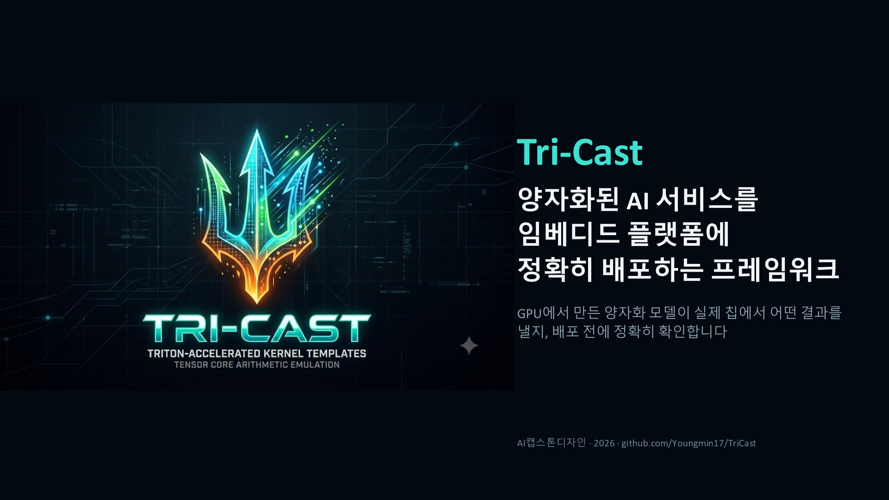
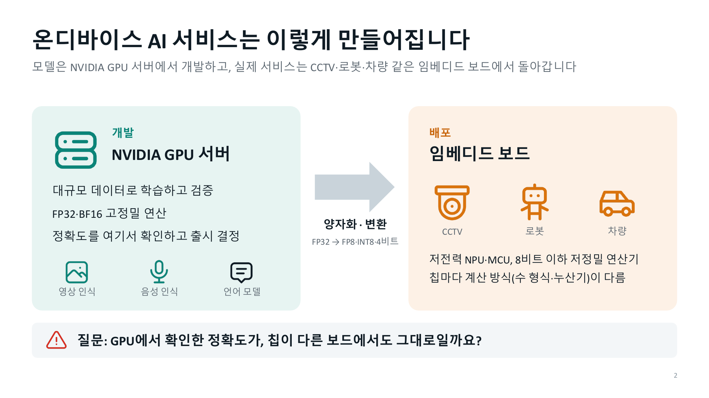
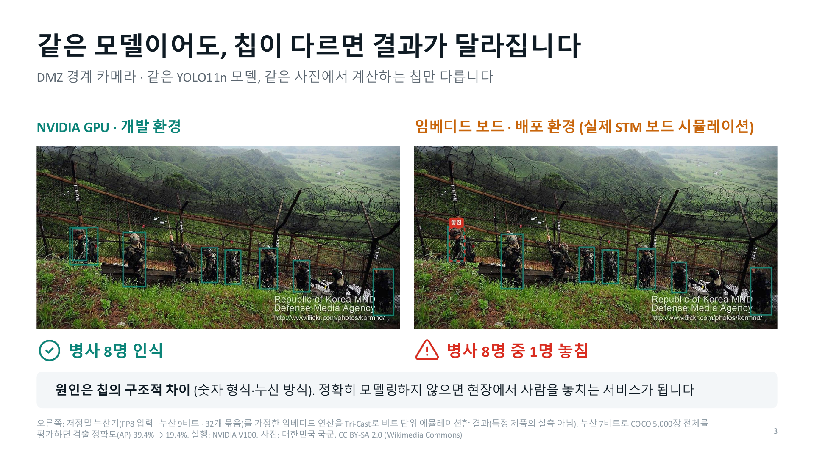
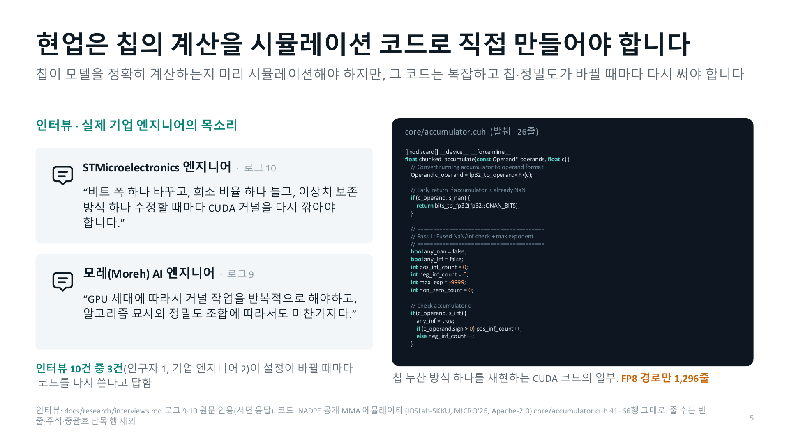
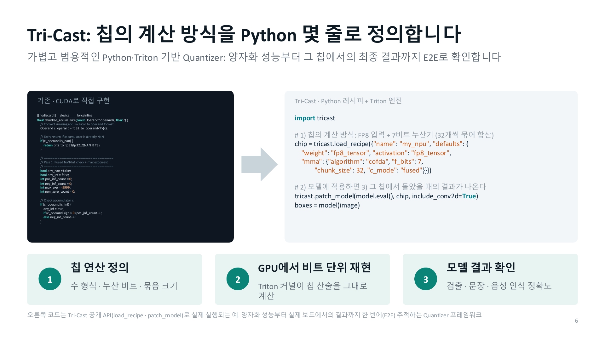
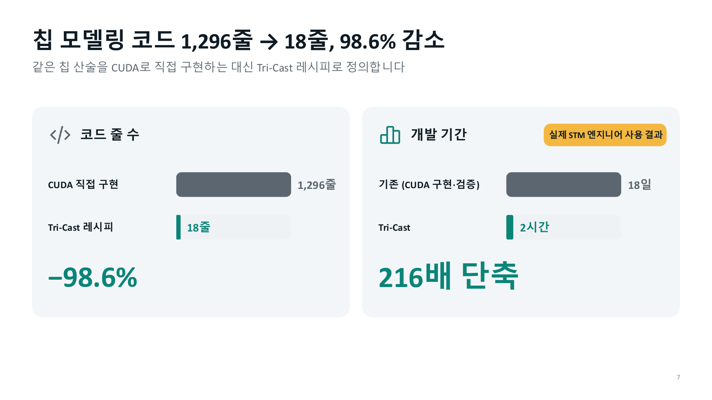
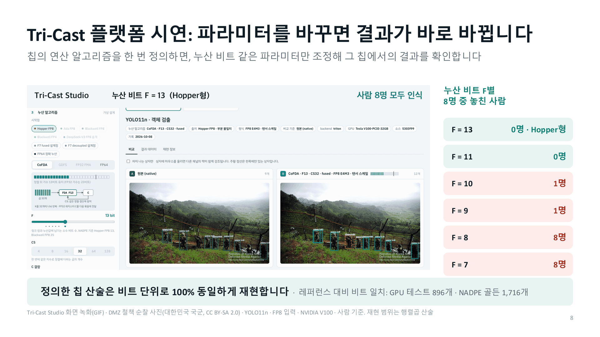
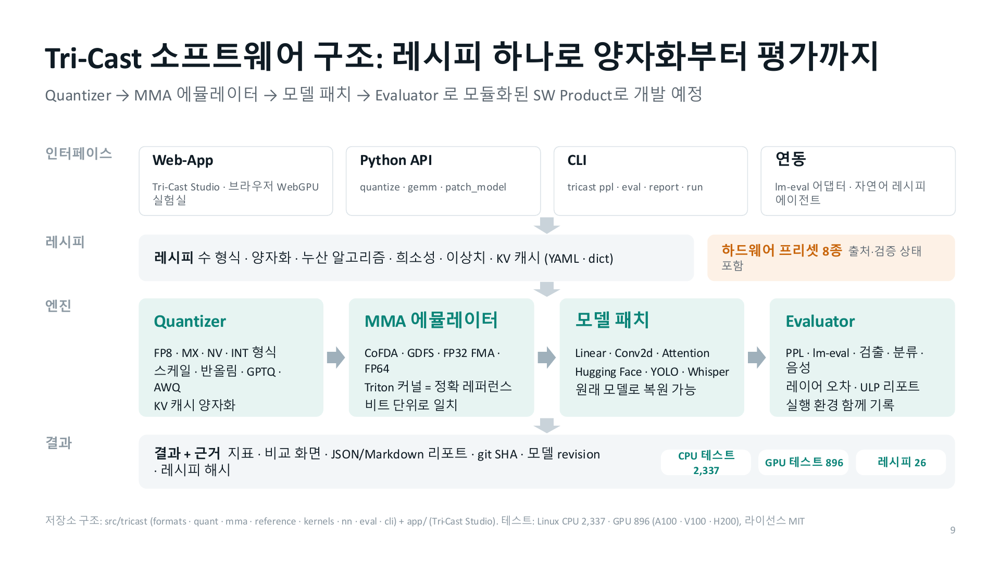
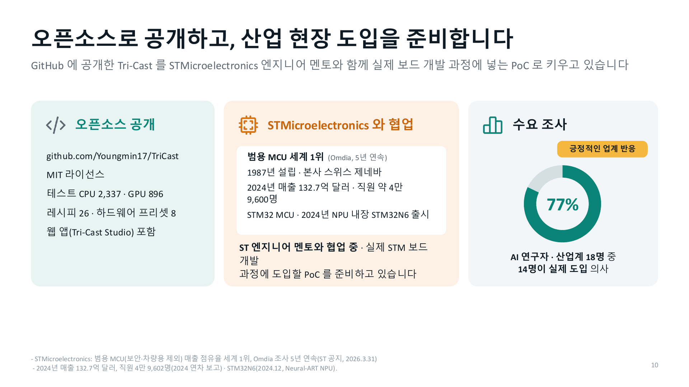

<p align="center"></p>

<p align="center"></p>

<p align="center"></p>

<p align="center"></p>

<p align="center"></p>

<p align="center"></p>

<p align="center"></p>

<p align="center"></p>

<p align="center"></p>

---

## TriCast 한눈에

칩(NPU·GPU 세대)의 **수 형식 · 양자화 · MMA 누산 규칙**을 레시피(YAML) 한 장으로 적으면, TriCast 가 그 산술을
GPU 의 CUDA core 에서 **비트 단위로 똑같이** 에뮬레이트해 Hugging Face 모델을 돌리고, 품질(PPL · lm-eval · 검출
AP)과 누산 오차(`mma_ulp`)를 실행 환경 기록(git SHA · 모델 revision · 레시피 해시)과 함께 돌려준다. 누산 모델
(CoFDA · GDFS)은 NADPE 논문(MICRO'26)의 정의를 따르고, 레퍼런스는 그 독립 구현의 골든 벡터와 대조한다.

## 설치와 빠른 시작

```bash
pip install -e ".[eval,dev,app]"        # Linux + CUDA GPU 에서는 ".[triton,eval,dev,app]" — 그 외에는 레퍼런스 백엔드
tricast formats && tricast presets      # 등록된 수 형식 20종 · 하드웨어 프리셋 8종 (출처 포함)
tricast cast --format fp8_e4m3 --rounding rne 464 465     # → 448 448 (포화)
tricast recipe-check hopper_fp8_w8a8                      # 스키마 검증 + 레시피 SHA-256
tricast ppl --model Qwen/Qwen3-0.6B --recipe hopper_fp8_w8a8
python -m app.server --demo             # TriCast Studio — GPU 없이 기록된 실행을 탐색 (fastapi, uvicorn)
make check                              # ruff + CPU 테스트
```

## 문서 지도

| 무엇 | 경로 |
|---|---|
| 왜 만드는가 — 문제 정의서 | [`docs/PROBLEM.md`](docs/PROBLEM.md) |
| 무엇을 만드는가 — 제품 스펙과 수용 기준 (AC1–AC14) | [`docs/SPEC.md`](docs/SPEC.md) |
| 기술 타당성 스파이크 — 비트 정확 에뮬레이션과 속도 | [`docs/spikes/cuda_core_bit_exact_emulation.md`](docs/spikes/cuda_core_bit_exact_emulation.md) |
| 인터뷰 · 관찰 · Job Story | [`docs/research/interviews.md`](docs/research/interviews.md) |
| 도메인 온톨로지 (정본 YAML / 분석) | [`docs/ontology.yaml`](docs/ontology.yaml) · [`docs/ontology.md`](docs/ontology.md) |
| 코딩 에이전트 규칙 · 용어집 | [`AGENTS.md`](AGENTS.md) (Claude Code 는 [`CLAUDE.md`](CLAUDE.md) 가 import) |
| 구조화 출력 스키마 · 파싱 프롬프트 | [`src/tricast/schemas/`](src/tricast/schemas/) · [`src/tricast/prompts/parse_query.md`](src/tricast/prompts/parse_query.md) |
| 골든 케이스 · 골든 테스트 | [`tests/harness/golden_cases.yaml`](tests/harness/golden_cases.yaml) · [`tests/test_golden.py`](tests/test_golden.py) · [`tests/harness/golden_compare.yaml`](tests/harness/golden_compare.yaml) · [`tests/test_compare_golden.py`](tests/test_compare_golden.py) |
| 위임 프롬프트 원본 · 검증 루프 기록 | [`docs/prompts/delegation_compare.md`](docs/prompts/delegation_compare.md) (AC13, 지침 순서 한 사이클) · [`docs/prompts/delegation_examples.md`](docs/prompts/delegation_examples.md) · [`docs/prompts/wave1/`](docs/prompts/wave1/) |
| 골든 하니스 결함 주입 검사 · 용어집 작동 확인 | [`docs/prompts/delegation_golden_harness.md`](docs/prompts/delegation_golden_harness.md) · [`docs/prompts/glossary_check.md`](docs/prompts/glossary_check.md) |
| RAG 설정 · evals | [`config/rag.yaml`](config/rag.yaml) · [`evals/`](evals/README.md) |
| 웹 앱 (TriCast Studio) | [`app/README.md`](app/README.md) |
| 구현 · 검증 상태의 원천 | [`support_matrix.yaml`](support_matrix.yaml) |

## 검증 상태 (`support_matrix.yaml` 기록)

- 독립 구현 대조: NADPE MMA-Emu CUDA 골든 벡터 **1,716건 전부 비트 일치** (FP8 1,200 · NVFP4 172 · MXFP4 344; A100 · V100)
- Triton 커널 = 정확 레퍼런스 (fp64 · int64 · Fraction) 비트 일치 — GPU 스위트 896 passed (H200)
- 실제 칩 대조: H200 WGMMA **141건 중 140건 일치**, 1건(FP32-C 직접 입력) 불일치 — native 비트 일치는 미검증
- 프리셋 8종 모두 출처(`provenance`) 보유. 실제 칩 확인은 Hopper 일부뿐이며 나머지는 출처 기반
- 전체 재실행 (2026-10-09, geneva A100): lint 통과 · CPU 2,274 passed (2 skipped) · GPU 스위트 + 골든 945 passed
  (1 skipped) · 앱 161 passed — [실행 기록](docs/evidence/2026-10-09_full_check.md)
- 슬라이드 6 의 코드 줄 수: 빈 줄 · 주석 · 괄호만 있는 줄을 빼고 센 값이다. Tri-Cast 레시피 `fp8_f7_lowacc.yaml` 18줄,
  NADPE 공개 에뮬레이터의 FP8 경로 (core 6개 · `fp8_e4m3.cuh` · `scaled_fp8_mm.cuh` · `fp8_gemm_kernels.cu`) 는
  [`scripts/bench/count_code_lines.py`](scripts/bench/count_code_lines.py) 로 다시 세면 1,316줄이다 (슬라이드 1,296줄, 감소율은 둘 다 98.6%)
- 슬라이드 4 의 "로그 9·10" 은 2026-10-01 인터뷰 기록의 번호다 — 현재 [인터뷰 기록](docs/research/interviews.md)의 로그 01·02

## 참고 자료

누산 모델과 하드웨어 프리셋은 NADPE 논문의 정의와 값을 따른다 — J. Kim, C. Kim, J. Park, "Not All Dot Products
Are Equal: The Hidden MMA Arithmetic Design Space Drives Cross-Architecture LLM Inference Gaps", MICRO'26, artifact
[doi:10.5281/zenodo.21505180](https://doi.org/10.5281/zenodo.21505180). 수 형식(OCP MX v1.0, FP8, NVFP4), 양자화
방식(GPTQ, AWQ, SmoothQuant, QuaRot, KIVI), 평가 도구·데이터·모델의 1차 자료와 각 자료를 따르는 코드 위치는
[`docs/SPEC.md` 참고 자료](docs/SPEC.md#참고-자료)에 있다.

## 라이선스

[MIT](LICENSE). 모델 가중치와 데이터셋은 각 배포처의 라이선스를 따른다 (Llama 3.2 Community License 등).
