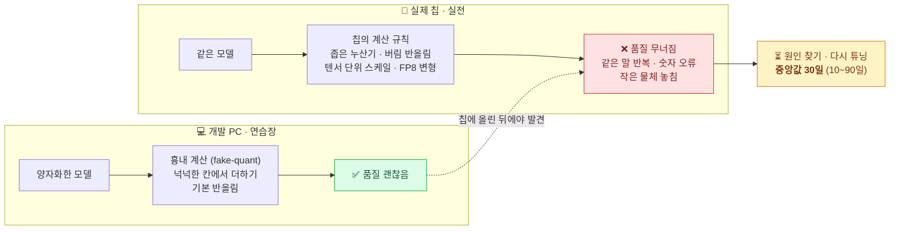
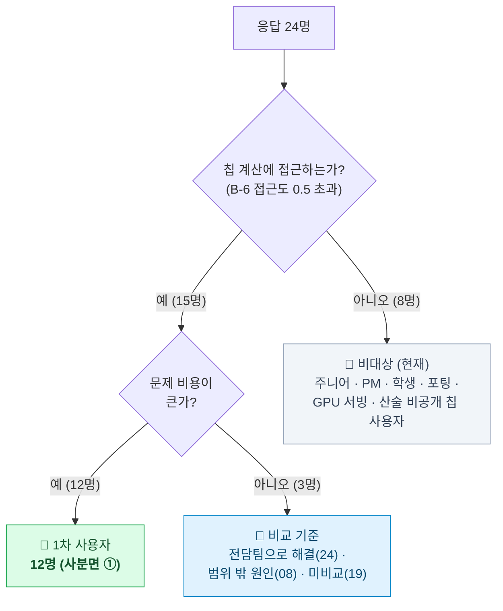
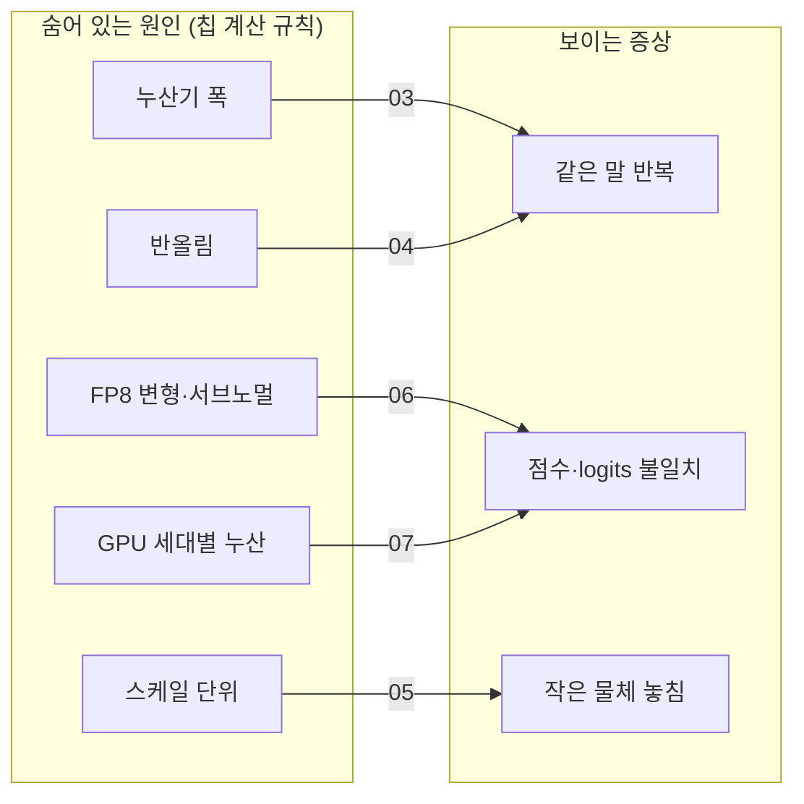
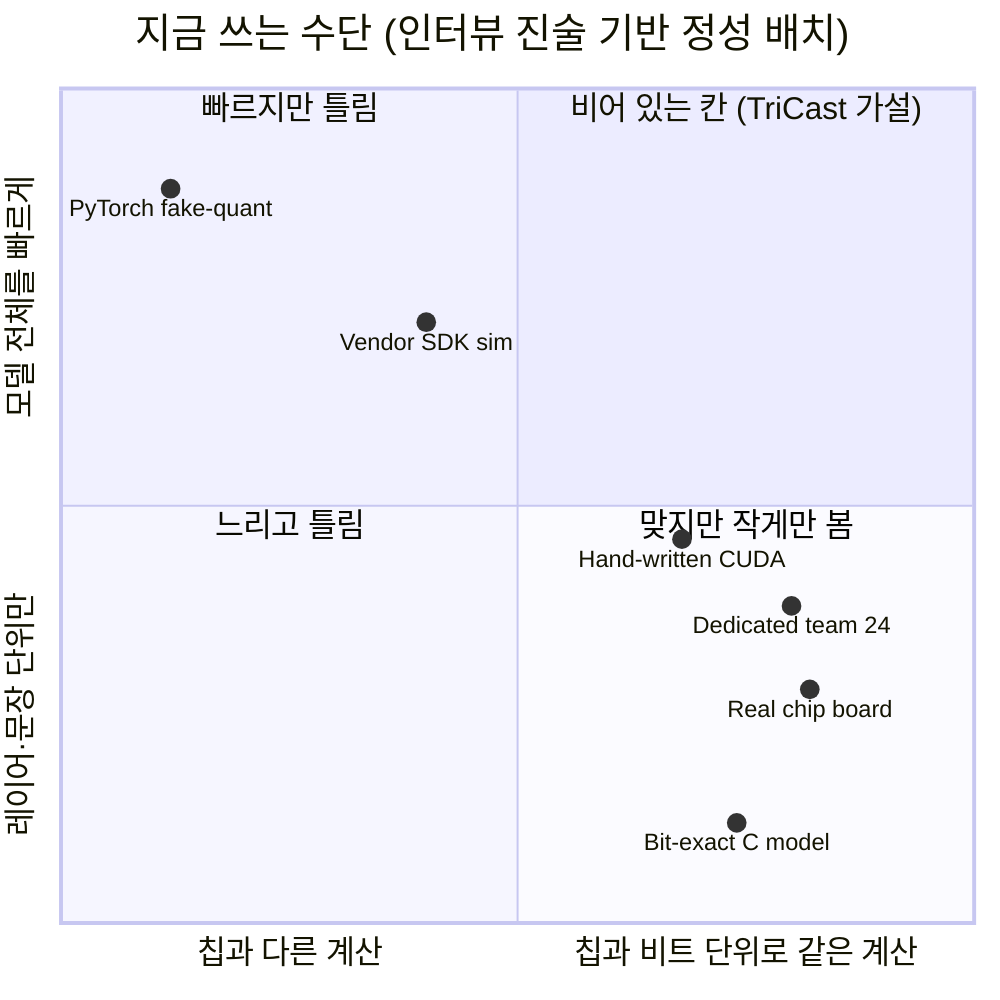
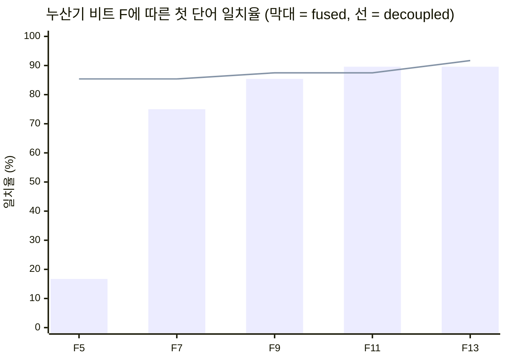
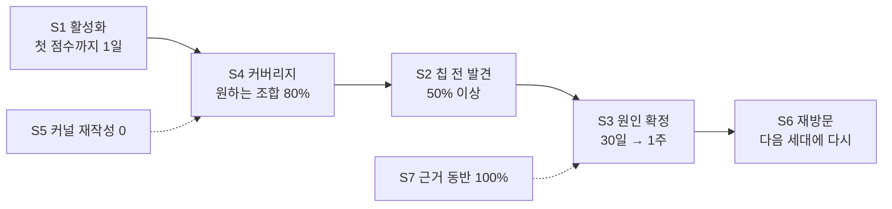

# 🧭 TriCast 문제 정의서

**Problem Definition** · v1.0 · 2026-10-08

`근거: 인터뷰 28건 (응답 24)` `기간 중앙값 30일` `칩 계산 직접 다룸 15명 중 13명 해당` `코드 기준 TriCast main`

[**문제 정의서**](./PROBLEM.md) · [제품 스펙](./SPEC.md) · [인터뷰](./research/interviews.md) · [온톨로지](./ontology.md)

---

> [!NOTE]
> **이 문서는 무엇인가요?** TriCast가 풀려는 문제가 **무엇이고, 누구의 문제이며, 정말 존재하는지**를 증거로 정리한 문서입니다. 무엇을 만들지는 [제품 스펙](./SPEC.md)에, 원자료는 [인터뷰](./research/interviews.md)에 있습니다.

## 📌 한 줄 요약

**AI 칩을 다루는 엔지니어는 PC에서 멀쩡하던 양자화 모델이 칩에서 망가지는 일을 겪는데, PC의 흉내 계산이 칩의 실제 계산 규칙을 따라 하지 못해 칩에 올린 뒤에야 알게 되고, 원인을 찾는 데 보통 한 달을 씁니다.**

### 🍞 쉽게 말하면 — "같은 레시피, 다른 오븐"

> 집 오븐(**PC**)에서 완벽하게 구워지던 빵 레시피(**AI 모델**)를 가게 오븐(**칩**)에 넣었더니 타 버렸습니다. 알고 보니 가게 오븐은 온도 눈금을 다르게 읽고(**반올림 방식**), 열을 모아 두는 칸이 좁았습니다(**누산기**). 문제는 이 차이를 **집 오븐으로는 미리 알 수 없다**는 것. 그래서 가게 오븐에 직접 구워 보며 하나씩 바꿔 보는 데 몇 주가 걸립니다.
>
> TriCast는 "가게 오븐의 규칙을 적은 카드(**레시피**)"만 있으면, 집에서도 가게 오븐과 **똑같이** 구워 볼 수 있게 하려는 도구입니다.

---

## 1. 한 문장 문제

> **양자화 모델을 칩에 올리거나 칩의 연산기를 설계하는 엔지니어가, 개발 환경의 양자화 흉내가 칩의 실제 계산 규칙(누산 폭·반올림·수 형식 변형·스케일 단위)을 재현하지 못해 칩에 올린 뒤에야 품질 저하를 발견하고, 원인 규명과 재튜닝에 수 주~수개월(중앙값 30일)을 쓴다.**

| 요소 | 내용 | 근거 |
|---|---|---|
| **누가** | 칩의 계산 규칙을 직접 다루는 NPU 컴파일러·검증·연산기 설계·FAE·온디바이스 엔지니어와 양자화 연구자 | 사분면 ① 12명 ([인터뷰 B-6](./research/interviews.md#b-6-누가-1차-사용자인가--사분면-분석)) |
| **무엇을 못 해서** | 칩과 **비트 단위로 같은** 계산을 **모델 전체 규모**로, **조합을 바꿔 가며 싸게** 돌려 보지 못함 | 로그 03, 07, 09 |
| **어떤 대가를** | 칩 투입 후 발견 → 원인 규명·재튜닝 중앙값 30일, 조합 변경마다 커널 재작성 4일, 설계 공간의 20% 이하만 탐색, 세대마다 18인월 | 로그 03, 07, 10, 24 |

---

## 2. 대상과 비대상

23번(양자화 경험 없음)은 분류에서 제외. 칩 계산 접근도는 인터뷰 B-6의 점수 — 0.5 초과에는 '모델 최적화 (칩 계산은 간접)' 0.55 도 들어간다.

### 🎯 1차 사용자 — 칩의 계산 규칙을 직접 다루는 사람

| 유형 | 하는 일 | 대표 로그 | 이들에게 문제가 되는 순간 |
|---|---|---|---|
| **칩 설계·사전 검증 연구자** | 칩이 나오기 전에 연산기 비트 수·누산 방식을 정함 | 01, 02, 07 | 조합 하나 바꿀 때마다 흉내 커널을 다시 짬 |
| **NPU 컴파일러·검증 엔지니어** | 모델을 자사 칩에 올리고 결과가 맞는지 확인 | 03, 06 | 칩에서 품질이 무너졌는데 PC에서 재현이 안 됨 |
| **FAE (고객 지원 엔지니어)** | 고객 모델을 자사 칩에 올리도록 도움 | 09 | 원인은 아는데 빨리 보여 줄 수단이 없음 |
| **온디바이스·임베디드 엔지니어** | 가전·카메라·셋톱·모바일 칩에 직접 변환해 올림 | 04, 05, 10, 12 | 보드에 구워야만 확인 가능 (회당 40분~반나절) |
| **양자화 연구자** | 특정 칩(FPGA 등) 계산을 반영한 양자화 기법 연구 | 11, 13 | 칩 규칙을 늦게 반영해 실험이 통째로 무의미해짐 |

### 🚫 비대상 (현재)

| 비대상 | 이유 | 로그 |
|---|---|---|
| 칩 계산 규칙이 **공개되지 않은** 칩의 사용자 | 규칙을 모르면 레시피를 쓸 수 없음 — 문제는 크지만 TriCast로 풀 수 없음 | 14, 16 (+27) |
| GPU 서빙만 하는 엔지니어 · API 사용자 | 칩에 올릴 일이 없음 | 22, 23 |
| 흔한 구조를 벤더 툴 기본값으로 충분히 처리하는 팀 | 문제 없음 (이틀, −0.6%p) | 21 |
| 칩 계산에 접근하지 않는 역할 (주니어 · PM · 학생 · 포팅 담당) | 차이를 봐도 원인을 다룰 위치가 아님 | 15, 16, 17, 18 |
| 비트 정확 모델 **전담팀**을 이미 둔 대기업 | 사람으로 해결 중 — 대신 그 비용(세대당 18인월)이 TriCast의 **비교 기준** | 24 |

---

## 3. 증거

### 3-0. 행동 증거 한눈에 — 무엇을 했고, 무엇을 치렀고, 어떻게 돌아갔나

의견이나 바람이 아니라 응답자가 **이미 한 일**만 모았다. 따옴표는 [인터뷰 로그 표](./research/interviews.md#b-3-전체-로그-28건)의
원문, `코드체`는 같은 행의 오픈 코딩 태그다. "있으면 쓰겠다"류 의향 발언은 증거에서 뺐다 (인터뷰 B-9).

| 로그 | 행동 (무슨 일이 있었나) | 지출 (시간 · 인력) | 우회 | 원문 |
|:-:|---|---|---|---|
| 03 | GPU 흉내로 잰 PPL 이 보드에서 무너짐 `PPL12→30+` | C 모델로 문장마다 확인 `C모델20분` | 누산 부분만 CUDA 로 다시 짬 `CUDA재작성` | "fake-quant는 … 내적은 fp32로 더하니까, 그 손실이 시뮬레이션에 아예 안 잡혀요" |
| 07 | 문서에 없는 누산 방식을 실험으로 거꾸로 추정 `역추정` | 조합 하나에 커널 수정 · 재검증 `실험당4일` | 원하는 조합의 일부만 실행 | "sweep하고 싶은 조합은 서른 개가 넘는데 실제로 돌린 건 여섯 개입니다" |
| 02 | 설계 변수를 바꿀 때마다 검증 커널 수정 `커널재작성` | 변수 하나당 커널 한 벌 | — | "비트 폭 하나 바꾸고, 희소 비율 하나 틀고, 이상치 보존 방식 하나 수정할 때마다 CUDA 커널을 다시 깎아야 합니다" |
| 04 | 반올림 규칙 차이를 늦게 발견 `반올림불일치` | 사양을 받으려고 세 번 문의 `문의3회` | 리비전마다 다시 작업 `리비전재작업` | "PC 시뮬레이션은 중간값을 짝수 쪽으로 반올림하는데, 칩은 … 아래 비트를 그냥 버리고 있었습니다" |
| 05 | 칩이 지원하지 않는 스케일 단위를 변환 툴이 경고 없이 바꿈 `벤더툴무경고` | 보드에 구워 확인 `보드40분루프` | — | "칩이 채널별 스케일을 지원 안 해요. 텐서 하나에 스케일 하나" |
| 10 | 원인을 못 찾아 레이어를 하나씩 풀어 봄 `200곳전수탐색` | `반나절루프` × 반복 = `3개월` | 레이어별 수동 탐색 | "PC 결과랑 폰 결과가 순위부터 안 맞는다는 거예요" |
| 12 | 칩 결과를 PC 에서 재현 못 해 재학습 반복 `QAT4회` | 재학습 4회 | 클리핑 조정 `클리핑튜닝` | "박스에서 나온 숫자를 PC에서 똑같이 만들어 볼 수가 없다는 거요" |
| 08 | 활성함수 표 근사 때문에 숫자가 틀림 `LUT근사` | — | 해당 연산을 CPU 로 뺌 `CPU우회` | "NPU가 GELU랑 softmax를 … 256칸짜리 표에서 찾아오는 거였어요" |
| 24 | 칩 세대마다 비트 정확 모델을 먼저 만듦 `비트정확모델선행` | 전담 인력 `전담6명` | 사람으로 해결 | "칩 세대가 바뀔 때마다 여섯 명이 석 달을 씁니다" |

**문제를 겪지 않는 집단** — 같은 질문에 문제가 없었거나 문제를 다룰 위치가 아니었던 응답자도 그대로 남겼다 (§2 비대상의 근거).

| 로그 | 왜 문제가 없었나 | 원문 |
|:-:|---|---|
| 21 | 흔한 INT8 구조라 벤더 기본값으로 충분 `기존도구충분` | "정확도가 0.6%p 떨어졌는데 벤더 문서에 적힌 범위 그대로였습니다" |
| 22 | 칩에 올리지 않고 GPU 서빙만 함 `GPU서빙만` | "저한테 양자화는 그냥 다운로드 옵션이에요" |
| 19 | 칩 출력과 비교해 본 적이 없음 `칩비교미실시` | "'달랐던 경험이 없다'가 아니라 '달랐는지 모른다'가 정확한 답이겠네요" |
| 15 | 원인을 파고들 역할이 아님 `역할상비접근` | "양자화 때문이었는지도 확실하지 않습니다" |

### 3-1. 사용자 증거 (인터뷰 로그 번호 필수)

- **출력이 예상과 달랐다 — 흔하다**: 응답 24명 중 **19명(79%)** 이 Q2(그때 모델 출력이 예상과 달랐던 경험)에 Yes. 칩 계산 접근도가 0.5를 넘는 15명 중 **13명(87%)** 이 칩 투입 후 사례나 반복 비용을 말함 (§4-1 넓은 기준, 로그 01–13)
- **원인은 칩의 계산 규칙이었다**: 원인을 찾은 9명 모두 "개발 환경과 칩의 계산 차이"를 짚음
  - 누산기 비트 폭·묶음 크기 — 곱을 묶음 단위로 좁은 누산기에 정렬하면서 하위 비트를 버림 (요약 — 로그 03, 01, 02, 07, 09)
  - 반올림 방식 — *"PC 시뮬레이션은 중간값을 짝수 쪽으로 반올림하는데, 칩은 … 아래 비트를 그냥 버리고"* (로그 04, 09, 11)
  - 수 형식 변형 — *"같은 E4M3라도 … 최대 표현값이 240과 448로 갈립니다"* (로그 06)
  - 스케일 단위 — *"텐서 하나에 스케일 하나"* (로그 05)
- **흉내 도구가 그 차이를 못 보여 준다**: *"내적은 fp32로 더하니까, 그 손실이 시뮬레이션에 아예 안 잡혀요"* (로그 03, 02, 09)
- **정확한 도구는 너무 느리다**: 비트 정확 C 모델은 문장 하나에 약 20분 → PPL을 못 잼 (요약 — 로그 03 `C모델20분`, 09)
- **조합이 바뀔 때마다 다시 짠다**: *"비트 폭 하나 바꾸고 … 할 때마다 CUDA 커널을 다시 깎아야"* (로그 02, 01, 03, 07, 11)
- **원인을 못 찾으면 전수 탐색**: 레이어 200곳을 하나씩 풀어 보며 3개월 (로그 10), 재학습 4회 (로그 12), 5주 (로그 13)

### 3-2. 문제의 구조 — 증상만으로는 원인을 알 수 없다

> [!IMPORTANT]
> **같은 "말 반복"인데 03은 누산기, 04는 반올림이 원인이었습니다.** 증상 → 원인 방향으로는 추론이 안 되니, 원인 후보(계산 규칙)를 **하나씩 켜고 끄며** 결과를 비교할 수 있어야 합니다. 이것이 "레시피" 단위 설계의 근거입니다.

### 3-3. 비용 증거

| 비용 | 값 | 로그 |
|---|---|---|
| 원인 규명·재튜닝·지연 기간 | **중앙값 30일**, 평균 36.7일, 범위 10~90일 (n=11), 합계 404일 | 03 05 06 09 10 11 12 13 14 16 18 |
| 한 번 확인하는 데 드는 시간 | 40분 (보드) · 반나절 (폰) · 수 시간 (긴 문맥) · 3일 (재학습) · 4일 (커널 수정) · 20분/문장 (C 모델) | 05 10 13 12 07 03 |
| 탐색한 설계 공간 | 원하던 30개 이상 중 **6개** (≤ 20%) | 07 |
| 우회로 인한 영구 손실 | 토큰당 속도 −30% (softmax를 CPU로) · 절감 폭 계획의 절반 · 정확도 96% → 91%로 출시 | 08 13 12 |
| 사람으로 푸는 비용 | 칩 세대마다 6명 × 3개월 = **18인월** | 24 |
| 고객 지원 부담 | 칩에서만 결과가 다르다는 문의 **분기 약 20건**, 그중 절반이 계산 규칙 차이 (요약) | 09 |

### 3-4. 기존 대안의 빈칸

사람들이 지금 쓰는 수단을 "칩과 같은 계산인가 × 모델 전체를 빨리 볼 수 있나"로 놓으면, **둘 다 되는 칸이 비어 있습니다.**

| 수단 | 왜 빈칸을 못 채우나 | 로그 |
|---|---|---|
| PyTorch fake-quant | 누산은 fp32, 반올림은 기본값 → 칩의 손실이 안 보임 | 03 09 11 |
| 벤더 SDK 시뮬레이터 | 일부(LUT 등)를 재현하지 않고, 변환 시 경고 없이 규칙을 바꿈 | 05 08 |
| 비트 정확 C 모델 | 정확하지만 문장당 수 분~20분 → 레이어 단위만 | 03 09 |
| 실제 칩·보드 | 정확하지만 1회 40분~반나절, 원인은 보이지 않음 | 05 10 12 |
| 직접 짠 CUDA 커널 | 빠르지만 조합·세대마다 다시 짜고 다시 검증 (4일/실험) | 01 02 03 07 |
| 전담팀 | 가능하지만 세대당 18인월 — 대부분의 회사는 감당 못 함 | 24 |

### 3-5. 제품 데이터로 본 문제의 크기 (TriCast 저장소 측정값)

> [!NOTE]
> 아래는 **사용자 증거가 아니라** TriCast 코드 저장소에 기록된 측정값입니다. "누산기 칸 크기 하나만 바꿔도 품질이 무너진다"는 인터뷰 진술(로그 03·07)이 **측정 가능한 현상**인지 확인하는 용도로만 씁니다.

**① 누산기 비트 수(F)만 바꿨을 때 — Qwen3-0.6B, A100, 48토큰 생성** (`app/web/demo/runs/qwen3-p1-*.json`)

조건: FP8 E4M3 · 텐서 단위 스케일 · CoFDA 묶음 32 · 원본(bf16) 모델과 비교 · KL은 다음 단어 확률 분포 차이(작을수록 원본과 비슷)

| 누산기에 남기는 비트 F | fused: 첫 단어 일치율 | fused: KL | decoupled: 첫 단어 일치율 | decoupled: KL |
|:-:|:-:|:-:|:-:|:-:|
| 25 | 89.6% | 0.019 | — | — |
| 13 *(Hopper 프리셋)* | 89.6% | 0.017 | 91.7% | 0.018 |
| 11 | 89.6% | 0.028 | 87.5% | 0.023 |
| 9 | 85.4% | 0.047 | 87.5% | 0.032 |
| **7** | **75.0%** | **0.243** (FP64 대비 13배) | 85.4% | 0.027 |
| **5** | **16.7%** | **6.006** (328배) | 85.4% | 0.055 |
| FP64 정확 누산 (기준) | 87.5% | 0.018 | | |

**읽는 법**
- F ≥ 11에서는 FP64 정확 누산과 거의 같습니다. 그런데 **F = 7에서 KL이 13배, F = 5에서 328배**로 뛰며 문장이 무너집니다 — 칸 크기에 따라 **절벽처럼** 무너지는 구조입니다.
- 같은 F = 5라도 누산 결과를 합치는 방식(fused ↔ decoupled)에 따라 결과가 정반대입니다. **"비트 수"만 맞춰서는 안 되고, 칩의 누산 구조까지 그대로 따라 해야** 한다는 뜻입니다 → 로그 07이 "묶음 크기"까지 역추정해야 했던 이유.

**② 모델 전체 평가에서 — 같은 현상의 규모**

| 모델 · 데이터 | 원본 | 누산기 F = 7 (fp8_f7_lowacc) | 변화 | 출처 |
|---|:-:|:-:|:-:|---|
| Llama-3.2-1B · WikiText-2 전체 (288,627 토큰) PPL | 9.76 | **141.25** | **×14.5** | `support_matrix.yaml` (A100) |
| Llama-3.2-1B · Winogrande 1,267문항 정확도 | 60.2% | 49.6% | −10.7%p | 〃 |
| YOLO11n · COCO val 5,000장 AP50-95 | 39.4 | 19.4 | **−50.8%** | 〃 (H200) |
| Llama-3.2-1B · PPL (Hopper 프리셋 F = 13) | 9.757 | 9.880 | +1.3% | 〃 (H200) |

로그 03이 겪은 "PPL 12 → 30 이상(×2.5)"은 이 범위 안에 있는 현상입니다. 같은 FP8이라도 **누산기 규칙에 따라 +1.3%에서 ×14.5까지** 갈립니다.

**③ 수 형식 변형 — 로그 06의 240 vs 448** (`src/tricast/formats.py`로 계산)

| 형식 | 특수값 규칙 | 최대 표현값 | 가장 작은 양수 |
|---|---|:-:|:-:|
| `fp8_e4m3` (fn) | 맨 위 칸 일부만 NaN | **448** | 2⁻⁹ ≈ 0.00195 |
| `fp8_e4m3fnuz` | NaN을 −0 자리에 | **240** | 2⁻¹⁰ ≈ 0.00098 |
| `e4m3:fn:nosub` | 서브노멀을 0으로 | 448 | 2⁻⁶ ≈ 0.0156 |

같은 "E4M3"라는 이름 아래 최대값이 1.9배, 가장 작은 값이 8배까지 다릅니다. 로그 06이 3주를 쓴 원인이 코드 한 줄(`special`, `:nosub`)의 차이입니다.

---

## 4. 반증 조건

문제 정의서에는 두 층의 주장이 있습니다. 각각 **"무엇이 관찰되면 이 주장을 버릴지"** 를 미리 정해 둡니다.

### 4-1. 문제의 실재 (인터뷰 증거로 지금 판정)

- **주장**: 칩의 계산 규칙을 직접 다루는 엔지니어는, 개발 환경이 칩 계산을 재현하지 못해 칩 투입 후에야 품질 차이를 발견하고 원인 규명·재튜닝에 1주 이상을 쓴다.
- **반증 조건**: 칩 계산을 직접 다루는 대상자 중 최근 1년 안에 **"칩 투입 후 발견 + 1주 이상 소요"** 사례가 **30% 미만**이면 문제 정의를 기각하고 대상 또는 문제를 다시 씁니다.

| 판정 항목 | 엄격 기준 (기간을 말한 사례만) | 넓은 기준 (설계 단계 반복 비용 01·02·07 포함) |
|---|:-:|:-:|
| 대상자 (칩 계산 접근도 0.5 초과, 23번 제외) | 15명 | 15명 |
| 해당 사례 | 8명 (03 05 06 09 10 11 12 13) | 13명 (01–13) |
| 비율 | **53%** | **87%** |
| 기준 30% | ✅ 통과 — **유지** | ✅ 통과 — **유지** |

> [!NOTE]
> v2 프로토콜([인터뷰 A-2](./research/interviews.md#a-2-보완한-프로토콜-v2--5문항--다음-인터뷰부터-사용))로 인터뷰를 이어 갈 때도 같은 30% 기준으로 판정합니다.

### 4-2. 해결 가설 (제품 사용 관찰로 이후 판정)

- **가설**: *칩의 계산 규칙을 레시피 한 장으로 적으면 GPU에서 칩과 비트 단위로 같은 결과와 모델 수준 점수를 바로 받는 것*이, 원인 규명 기간과 커널 재작성을 줄인다.
- **반증 조건**: 레시피로 표현 가능한 원인을 가진 사용자가 TriCast 결과를 받고도 ① 칩이나 C 모델에서 레이어 덤프 비교를 처음부터 다시 하거나, ② 조합을 바꾸려고 자체 CUDA 커널을 다시 짜면 가설을 기각합니다.
- **따로 세는 경우** (가설 실패로 치지 않음)

| 상황 | 무엇의 문제로 세나 | 연결 |
|---|---|---|
| 원인이 레시피 범위 밖 (LUT 근사, 비공개 계산 규칙) | **범위(커버리지)** 문제 | 로그 08, 14 |
| TriCast 결과가 실제 칩과 비트 단위로 다름 | **프리셋·엔진 품질** 문제 | [스펙 AC1·AC2](./SPEC.md#6-수용-기준) |
| 레시피 작성 자체에 막힘 (스키마 오류 등) | **사용성** 문제 | [스펙 AC5](./SPEC.md#6-수용-기준) |

---

## 5. 성공의 정의 (행동 지표)

말이 아닌 **행동**으로 잽니다. 기준선은 인터뷰에서 가져왔고, 목표는 초기 목표입니다.

| # | 지표 | 정의 (행동) | 기준선 (인터뷰) | 초기 목표 |
|:-:|---|---|---|---|
| S1 | **활성화** | 첫 레시피를 써서 `recipe-check` 통과 후 첫 모델 점수(PPL 등)를 받기까지 걸린 시간 | — (해당 수단 없음) | **1일 이내** |
| S2 | **칩 투입 전 발견율** | 칩에서 발견된 차이 중, TriCast로 미리 재현됐던 비율 | 0% — 칩 배포 사례는 모두 칩 투입 후 발견 (설계 단계 01·02·07 제외) | **50% 이상** |
| S3 | **원인 확정 시간** | 칩 차이를 본 시점 → 원인 규칙 확정까지 | 중앙값 30일 (n=11) | **1주 이내** |
| S4 | **설계 공간 커버리지** | 평가하고 싶던 조합 중 실제로 평가한 비율 | 07: 20% 이하 (6/30+) | **80% 이상** |
| S5 | **커널 재작성 0** | 조합·칩 세대 변경 시 직접 짠 CUDA 커널 수 | 조합마다 1회 (4일) | **0회** (레시피 수정만) |
| S6 | **재방문 (리텐션)** | 다음 칩 리비전·세대 때 기존 레시피를 고쳐 다시 평가한 비율 | — | **70% 이상** |
| S7 | **근거 동반률** | 공유된 결과 중 실행 환경(git SHA·모델 revision·레시피 해시)이 함께 있는 비율 | 16 "누구 책임인지 가릴 기준이 없다는 거죠" · 18 | **100%** ([AC3](./SPEC.md#6-수용-기준)) |

---

## 6. 범위 밖으로 명시한 문제

| 문제 | 왜 범위 밖인가 | 로그 |
|---|---|---|
| 칩 계산 규칙이 공개되지 않은 경우 | 규칙을 모르면 흉내 낼 수 없음. 역공학은 하지 않음 | 14, 16, 27 |
| 활성함수 표(LUT) 근사 | 현재 레시피 항목에 없음 → 다음 버전 후보 | 08 |
| 칩의 속도·전력·면적 예측 | TriCast는 **계산 결과**를 맞추는 도구이지 성능 시뮬레이터가 아님 | 01, 02 (설계 목적은 공유) |
| 칩 컴파일러·배포 자동화 | 칩 벤더의 영역 | 05 (벤더 툴) |
| 측정 수단이 없는 팀의 일반 품질 관리 | 칩 계산과 무관한 원인(프롬프트, 샘플링)일 수 있음 | 17, 20 |

## 7. 열린 질문

1. 칩 벤더가 계산 규칙을 **부분적으로만** 공개할 때(예: 반올림만 공개), 나머지를 어떻게 표시할까? → 스펙의 `provenance` "미검증" 표기와 연결
2. 비공개 칩 사용자(사분면 ②: 14, 16, 18)를 위한 2차 제품이 필요한가? — 예: 후보 규칙을 자동으로 바꿔 가며 칩 결과와 맞춰 보는 기능
3. "전담팀(세대당 18인월)" 대비 TriCast의 비용을 어떤 단위로 비교할까?

---

출처: 팀 인터뷰 기록 28건 (「TriCast 인터뷰 사례 모음집」) · TriCast 저장소 코드 `github.com/Youngmin17/TriCast` — `src/tricast/formats.py`, `support_matrix.yaml`, `app/web/demo/runs/*.json`.
