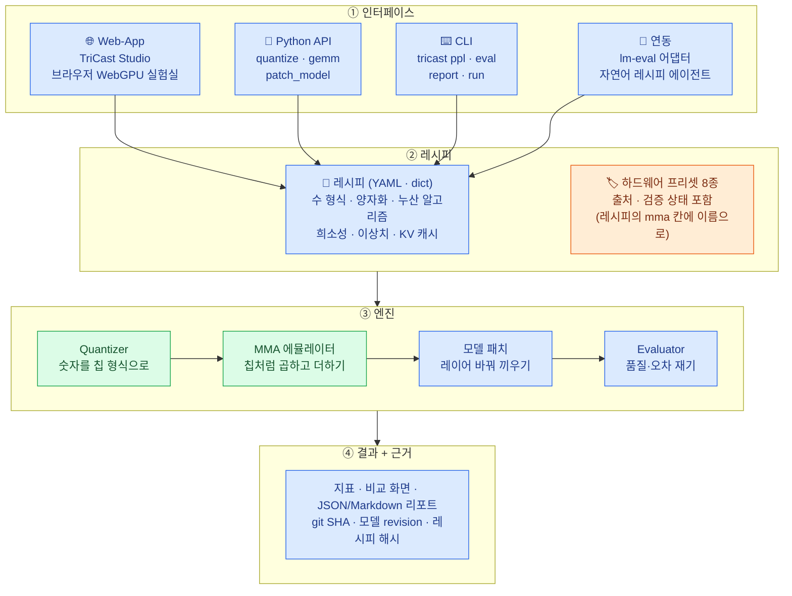
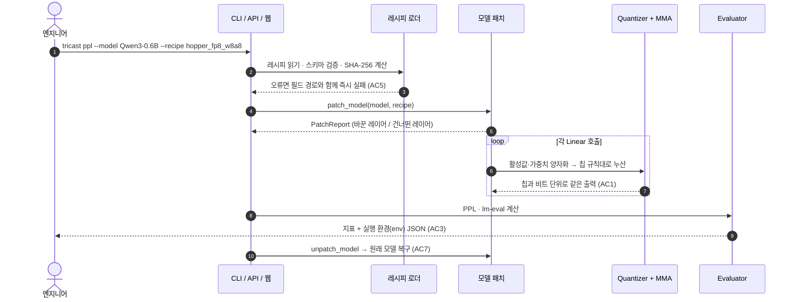
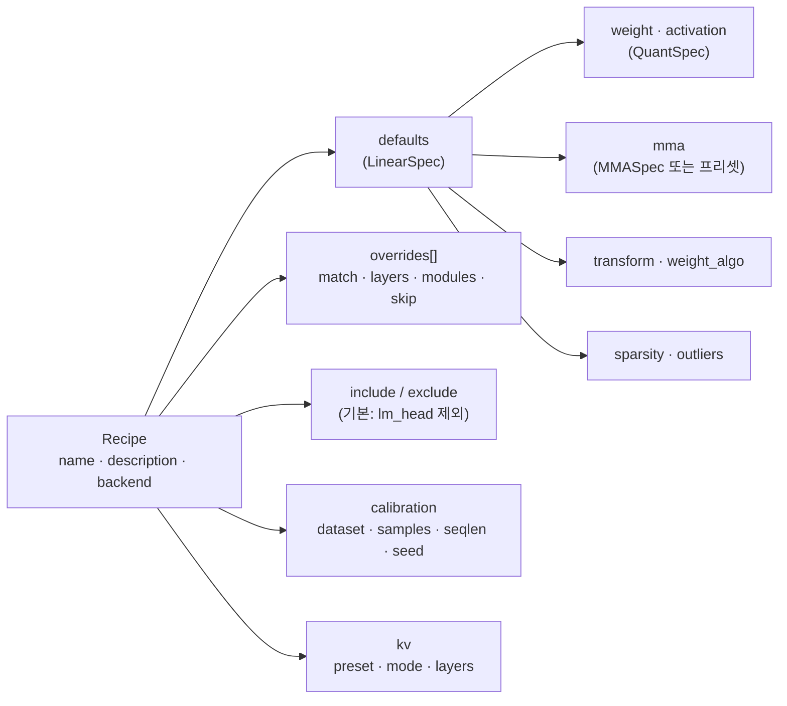
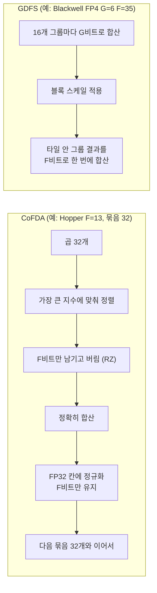
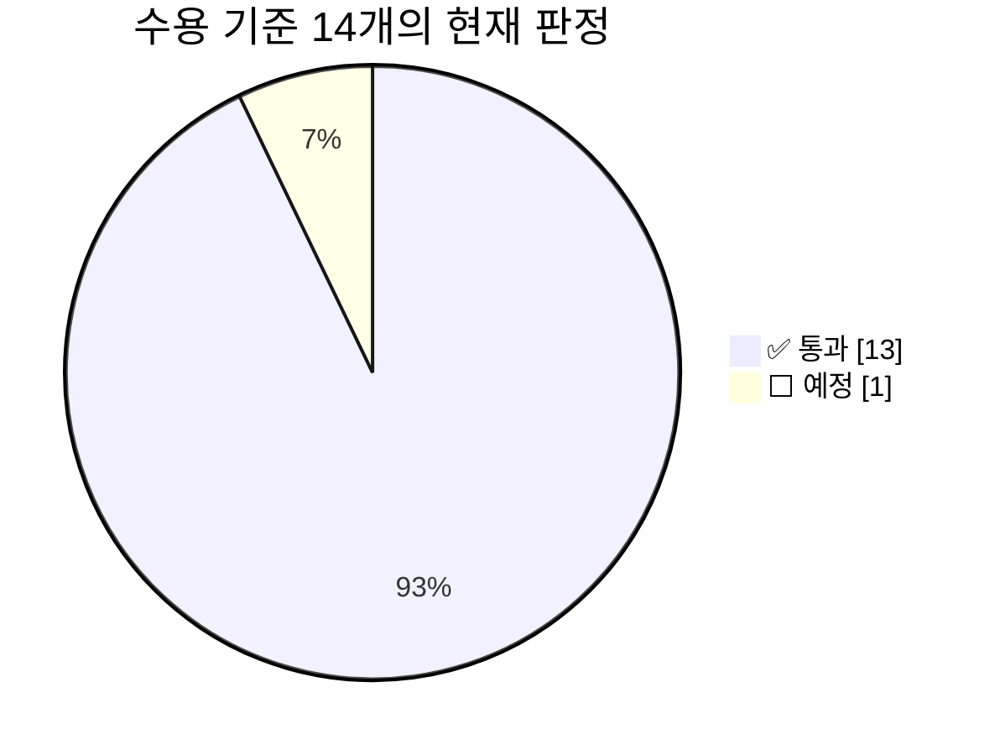
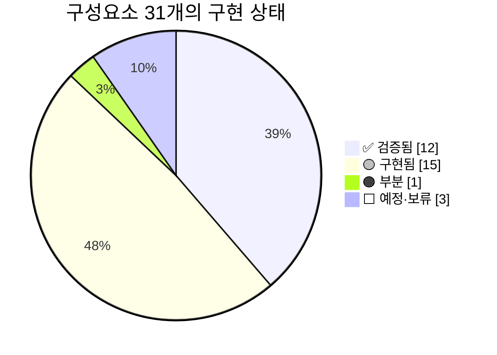
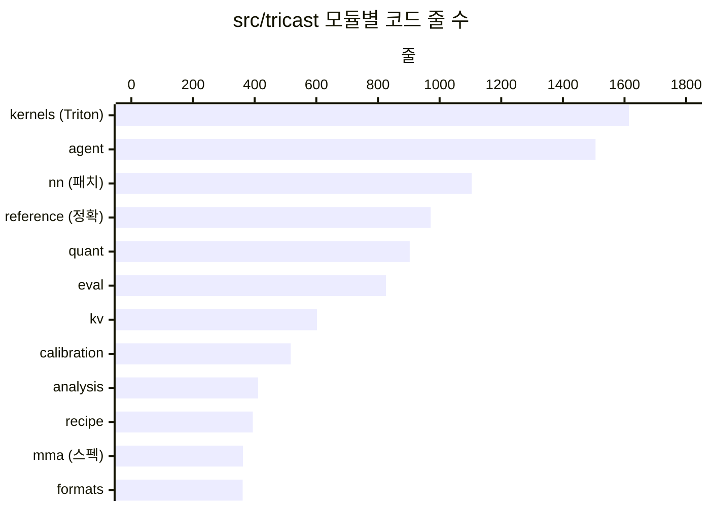
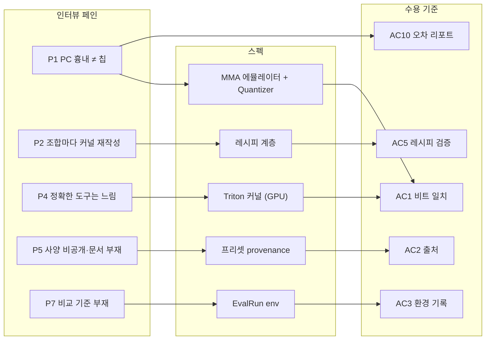

<div align="center">

# 📐 TriCast 제품 스펙 (SDD)

**Spec-Driven Development** · v1.0 · 2026-10-08

`레시피 26종` `하드웨어 프리셋 8종` `CPU 테스트 2,274 통과` `GPU 스위트+골든 945 통과` `NADPE 벡터 1,716/1,716 비트 일치`

[문제 정의서](./PROBLEM.md) · [**제품 스펙**](./SPEC.md) · [인터뷰](./research/interviews.md) · [온톨로지](./ontology.md)

</div>

---

> [!NOTE]
> **이 문서는 무엇인가요?** TriCast를 **무엇으로 만들지** 정한 단일 기준 문서입니다(스펙 주도 개발). 구조는 아키텍처 그림의 4층(인터페이스 → 레시피 → 엔진 → 결과)을 그대로 따르고, 각 항목의 **구현 상태는 저장소 코드와 `support_matrix.yaml`에서 확인한 사실**만 적었습니다.
>
> 상태 표시: ✅ 검증됨 (테스트 증거 있음) · 🟡 구현됨 (코드 + CPU 테스트) · 🟠 부분 · ⬜ 예정·보류

## 📌 한 줄 요약

**칩의 계산 규칙을 레시피 한 장에 적으면, TriCast가 그 계산을 GPU에서 칩과 비트 단위로 똑같이 흉내 내어 AI 모델을 돌리고, 품질 점수와 오차를 실행 환경 기록과 함께 돌려줍니다.**

> 🍞 **쉽게 말하면**: 가게 오븐(칩)의 규칙 카드(레시피)를 넣으면, 집 오븐(GPU)이 가게 오븐과 **똑같이** 굽고, 맛 평가표(품질 점수)와 "어떤 오븐·어떤 재료로 구웠는지" 영수증(실행 환경)을 함께 주는 장치입니다.

---

## 1. 문제

칩을 다루는 엔지니어가 PC에서 멀쩡하던 양자화 모델이 칩에서 망가지는 일을 겪는데, PC의 흉내 계산이 칩의 실제 계산 규칙(누산 폭·반올림·수 형식 변형·스케일 단위)을 재현하지 못해 **칩에 올린 뒤에야** 알게 되고 원인 규명·재튜닝에 **중앙값 30일**을 쓴다. (상세: [PROBLEM.md](./PROBLEM.md))

## 2. 타깃 사용자

| 구분 | 누구 | 근거 |
|---|---|---|
| 🎯 **1차** | 칩의 계산 규칙을 직접 다루는 NPU 설계·검증·컴파일러 엔지니어, FAE, 온디바이스 엔지니어, 양자화 연구자 | 인터뷰 사분면 ① 12명 · 칩 계산 직접 다룸 15명 중 13명 해당 (PROBLEM §4-1) |
| 📏 비교 기준 | 비트 정확 모델 전담팀을 둔 조직 (세대당 18인월) | 로그 24 |
| 🚫 비대상 | 계산 규칙이 비공개인 칩의 사용자, GPU 서빙만 하는 엔지니어, 칩 계산에 접근하지 않는 역할(PM·주니어·학생) | 로그 14 16 21 22 23 · 15 17 18 |

## 3. 핵심 기능 (한 문장)

> **레시피 정의** (수 형식 · 양자화 · 누산 알고리즘 · 희소성 · 이상치 · KV 캐시) → **GPU에서 비트 정확 에뮬레이션** → **모델 품질·오차를 실행 환경과 함께 리포트**

## 4. 범위

| ✅ 포함 | ❌ 비포함 |
|---|---|
| 수 형식 정의 (float / int / pow2, 사용자 정의 ExMy·intN) | 실제 칩 RTL·사이클 단위 시뮬레이션 |
| 양자화 (스케일 단위·방법, 반올림 6종, 보정, GPTQ·AWQ·SmoothQuant) | 칩 속도·전력·면적 예측 |
| MMA 누산 에뮬레이션 (CoFDA·GDFS·FP32 FMA·FP64·정수) — **Tensor Core가 아닌 CUDA core에서** | Tensor Core 네이티브 실행 경로 |
| 하드웨어 프리셋 (출처·검증 상태 필수) | 출처 없는 하드웨어 수치 (모르면 "미검증") |
| 모델 패치 (Linear · Conv2d · Attention · KV 캐시), 원상 복구 | 활성함수 표(LUT) 근사 (로그 08 — 다음 버전 후보) |
| 평가 (PPL · lm-eval · 검출 · 레이어 오차 · ULP) + 실행 환경 기록 | 계산 규칙이 비공개인 칩의 역공학 (로그 14) |
| 인터페이스 (Python API · CLI · 웹 앱 · lm-eval · 자연어 에이전트) | 칩 컴파일러·배포, 모델 학습 파이프라인 (QAT는 STE 수준만) |

---

## 5. 아키텍처와 인터페이스

### 5-1. 전체 구조 — 레시피 하나로 양자화부터 평가까지



<sub>색: 초록 = 검증됨 · 파랑 = 구현됨(일부 하위 기능은 검증·예정 혼재, §8 참고) · 주황 = 부분 (프리셋 출처는 8/8, 실제 칩 확인은 일부)</sub>

**데이터가 흐르는 순서 (한 번의 평가)**



### 5-2. ① 인터페이스 계층

> 🍞 **쉽게 말하면**: 같은 장치를 쓰는 4가지 출입구입니다. 연구자는 Python, 반복 실험은 CLI, 시연과 탐색은 웹 화면, 기존 벤치마크 도구와는 어댑터로 연결합니다.

**Python API** (`import tricast`)

| 함수 | 입력 | 출력 | 상태 |
|---|---|---|:-:|
| `quantize(x, spec)` | 텐서, 양자화 방식 이름 또는 `QuantSpec` | `QTensor` (형식 위의 값 + 스케일) | ✅ |
| `gemm(a, b, spec, bias=None)` | 활성 `[..., K]`, 가중치 `[N, K]`, `MMASpec` 또는 프리셋 이름 | `Tensor [..., N]` — 칩 규칙대로 누산한 결과 | ✅ |
| `patch_model(model, recipe, include_conv2d=False)` | Hugging Face·torchvision 모델, 레시피 | `PatchReport {patched, skipped, layers, kv, unused_overrides}` | 🟡 |
| `unpatch_model(model)` | 패치된 모델 | 원래 모듈로 복구 | ✅ |
| `patch_attention(model, AttentionSpec)` | Llama·Qwen3 (eager) | QK·PV 행렬곱도 에뮬레이트 | ✅ |
| `calibrate(model, recipe, tokenizer)` | 보정이 필요한 레시피 | 보정 통계·데이터셋 지문 | 🟡 |
| `layer_report(model, recipe, texts=…)` | 패치 전 모델 | 레이어별 오차 + 모델 KL·top-1 | 🟡 |

**CLI** (`tricast …`)

| 명령 | 입력 | 출력 | 상태 |
|---|---|---|:-:|
| `formats` · `schemes` · `presets` | — | 등록된 수 형식 20 · 양자화 방식 27(+`bfp<m>_b<n>`) · 프리셋 8 목록 | 🟡 |
| `cast --format fp8_e4m3 --rounding rne 464 465` | 형식·반올림·값 | 형식 눈금 위로 맞춘 값 (`448 448`) | 🟡 |
| `recipe-check <이름\|경로>` | 레시피 | 통과 또는 필드 경로가 담긴 오류 | 🟡 |
| `ppl --model M --recipe R` | 모델·레시피 | `runs/<UTC>/` 에 PPL + env JSON | 🟡 |
| `eval --model M --recipe R --tasks hellaswag,coqa` | lm-eval 과제 | 과제별 점수 + 데이터셋 지문 | 🟡 |
| `report --model M --recipe R` | 모델·레시피 | 레이어별 MSE·SQNR·코사인·mma_ulp + 모델 KL (JSON·Markdown) | 🟡 |
| `run configs/sweeps/<스윕>.yaml` | 기준 레시피 + 축 목록 | 조합별 결과 + 요약, 같은 조건이면 이어서 실행 | 🟡 |
| `agent "<자연어>" [--execute]` | 자연어 요청 | `EmulationRequest` JSON (모르는 값은 `null` + `assumptions`) | 🟡 |

**Web-App — TriCast Studio** (FastAPI, `python -m app.server`)

| 엔드포인트 | 입력 | 출력 | 상태 |
|---|---|---|:-:|
| `GET /api/health` | — | `{"status": "ok", "mode", "device"}` | 🟡 |
| `GET /api/catalog` | — | 누산 알고리즘 파라미터 공간 · 프리셋(출처·검증 상태) · 형식 · 모델 · 작업 | 🟡 |
| `GET /api/resources` | — | GPU · 대기열 · 캐시된 모델 | 🟡 |
| `POST /api/runs` | `{task, model, mma, format, baseline, input}` | 실행 id (라이브 모드, GPU 1개 순차 큐) | 🟡 |
| `GET /api/runs/{id}` | 실행 id | `{status, baseline, emulated, metrics, env, evidence, recipe.yaml}` | 🟡 |
| 브라우저 GPU 실험실 (`#webgpu`) | FP8 행렬곱 1개 설계 | WebGPU 결과를 JS 정확 레퍼런스·서버 결과와 **비트 대조** | 🟡 |

- 작업 3종: 텍스트 생성(Qwen3-0.6B·Llama-3.2-1B) · 객체 검출(YOLO11n) · 이미지 분류(ResNet18)
- 비교 기준 2종: `native`(원본 모델) · `same_quant_fp64`(같은 형식 + FP64 누산 → **누산만의 효과** 분리)
- 모드 3종: 예시 데이터(GPU 없이 기록된 96개 실행 탐색) · 서버 GPU(실시간) · 브라우저 GPU

**연동**

| 연동 | 사용법 | 상태 |
|---|---|:-:|
| lm-eval 어댑터 | `python -m tricast.eval.lmeval --model tricast --model_args pretrained=…,recipe=… --tasks …` | 🟡 (과제 메타데이터 기록 ✅) |
| 자연어 레시피 에이전트 | Claude API 구조화 출력 또는 오프라인 파서 → 스키마 검증 → 레시피 | 🟡 (오프라인 ✅, 실제 API 경로 미검증) |

### 5-3. ② 레시피 계층

> 🍞 **쉽게 말하면**: 레시피는 "이 칩은 이렇게 계산한다"를 적은 **설정 카드**입니다. 코드를 고치지 않고 카드의 숫자만 바꾸면 다른 칩이 됩니다. 인터뷰의 "비트 폭 하나 바꾸고, 희소 비율 하나 틀고, 이상치 보존 방식 하나 수정할 때마다 CUDA 커널을 다시 깎아야 합니다"(로그 02)와 설정마다 코드를 고치고 다시 검증했다는 진술(로그 11, 요약)의 불편을 이 계층이 없앱니다.

**레시피 구조**



**예시 — 인터뷰 로그 03 유형의 칩** (TriCast 로더로 검증 통과, SHA-256 `e99e2c6311bb…`)

```yaml
name: npu_x_w8a8
description: FP8 E4M3 W8A8, 32-product chunks truncated to F=13
defaults:
  weight: {scheme: fp8_row}                       # 가중치: FP8, 행(출력 채널)마다 스케일
  activation: {scheme: fp8_tensor, rounding: rne} # 활성값: FP8, 텐서 하나에 스케일 하나
  mma: {algorithm: cofda, f_bits: 13, chunk_size: 32, c_mode: fused, out_format: bf16}
                                                  # 32개씩 묶어 정렬 후 13비트만 남기고 버림
overrides:
  - layers: "0,-1"                                # 첫·마지막 블록은 원래 정밀도 (로그 10의 타협)
    skip: true
exclude: [lm_head]
kv: {preset: kivi4, mode: cache}                  # KV 캐시는 4비트 KIVI (로그 13)
```

**인터뷰의 원인을 레시피로 적으면** — 아래 조각은 모두 TriCast 로더(`load_recipe`)로 검증했습니다.

| 로그 | 인터뷰에서 들은 원인 | 레시피 한 줄 |
|:-:|---|---|
| 03 | 32개씩 묶어 좁은 누산기에 넣고 하위 비트를 버림 | `mma: {algorithm: cofda, chunk_size: 32, f_bits: 9}` |
| 04 · 11 | 칩은 반올림 대신 아래 비트를 버림 | `weight: {scheme: int8_row, rounding: rtz}` |
| 05 | 채널별이 아닌 텐서 하나에 스케일 하나 | `weight: {scheme: int8_tensor}` |
| 06 | 같은 E4M3인데 최대값 240, 서브노멀은 0으로 | `format: "e4m3:fnuz:bias=8:nosub"` |
| 07 | GPU 세대마다 다른 누산 방식 | `mma: nvidia_hopper_fp8` ↔ `nvidia_ada_fp8` ↔ `nvidia_blackwell_fp8` |
| 07 | 누산 비트 9 → 13 실험 | `run` 스윕 축 `mma.f_bits: [25, 21, 17, 13, 11, 9, 7, 5, 3]` |
| 02 | N:M 희소 + 이상치 따로 보존 | `sparsity: {kind: "n:m", n: 2, m: 4}` · `outliers: {fraction: 0.005, format: bf16}` |
| 10 · 14 | 앞쪽 2블록과 끝 블록만 8비트 | `overrides: [{layers: "0,1,-1", weight: {scheme: int8_row}}]` |
| 12 | 클리핑 기준 상위 99.99% | `activation: {scheme: int8_tensor, scale: {method: percentile, percentile: 99.99}}` |
| 13 | 앞쪽 레이어 KV 캐시만 8비트 | `kv: {preset: kv_fp8, layers: "0-7"}` |
| 08 | 활성함수를 256칸 표에서 찾음 | ⛔ 레시피 항목 없음 (범위 밖) |

**하드웨어 프리셋 8종** (`src/tricast/mma/spec.py` · `PRESETS`)

| 프리셋 | 누산 방식 | 핵심 값 | 출처 | 실제 칩 확인 |
|---|---|---|---|---|
| `nvidia_ada_fp8` | CoFDA | F=13, 묶음 16 | NADPE (MICRO'26) [[N1]](#참고-자료) | ⬜ 예정 |
| `nvidia_hopper_fp8` | CoFDA | F=13, 묶음 32 | NADPE | 🟠 H200 WGMMA 141건 중 **140건 일치** (1건: 0 부호·서브노멀 경계 차이) |
| `nvidia_blackwell_fp8` | CoFDA | F=25, 묶음 32 | NADPE | ⬜ 보류 (하드웨어 없음) |
| `nvidia_blackwell_fp4` | GDFS | G=6, F=35, 그룹 16, 타일 64 | NADPE | ⬜ 보류 (하드웨어 없음) |
| `deepseek_fp8_promote128` | CoFDA + FP32 승격 | F=13, 묶음 32, 128마다 승격 | DeepSeek-V3 보고서 §3.3.2 [[D1]](#참고-자료) | ⬜ 출처 기반 |
| `fp32_fma` | IEEE FP32 FMA | K 순서 | 정의 (하드웨어 주장 아님) | — |
| `fp64` | FP64 FMA → FP32 1회 반올림 | 수치 기준 | 정의 | — |
| `int_exact` | 정수 정확 합 | — | 정의 | — |

> [!IMPORTANT]
> **출처가 없으면 프리셋도 없습니다.** 프리셋 값을 사용자가 바꾸면 이름과 출처가 자동으로 비워져 "사용자 정의 가상 설계"로 표시됩니다(AC2). 인터뷰에서 "정답 기준을 검증하는 데만 1주"(로그 06)였던 불안을 **출처와 검증 상태를 숨기지 않는 것**으로 다룹니다.

**번들 레시피 26종** (`src/tricast/recipes/`) — 분류

| 분류 | 개수 | 레시피 |
|---|:-:|---|
| FP8 GPU 세대별 | 5 | `hopper_fp8_w8a8` `ada_fp8_w8a8` `blackwell_fp8_w8a8` `deepseek_fp8_block` `fp8_2of4_sparse` |
| FP8 누산기 축소 실험 | 2 | `fp8_f7_lowacc` `fp8_f7_decoupled` |
| FP8 정적 스케일 | 2 | `fp8_ema_static` `fp8_delayed_history` |
| 4·6·8비트 블록 형식 (MX·NV·MSFP) | 10 | `mxfp4_w_a` `mxfp6_w_a` `mxfp8_w_a` `mxfp4_rht` `nvfp4_w_a` `nvfp4_4o6` `nvfp4_awq_shared` `nvfp4_smoothquant` `nvfp4_outliers` `msfp12_bfp` |
| 정수 · GPTQ | 3 | `int8_row_w8a8` `w4a16_g128_zp_gptq` `w4a16_gptq_sequential` |
| 레이어 혼합 · KV | 2 | `mixed_first_last_bf16` `kivi2_kv` |
| 기준선 | 2 | `bf16_passthrough` `fp64_reference` |

### 5-4. ③ 엔진 계층

#### Quantizer — "숫자를 칩의 형식으로 바꾸기"

> 🍞 **쉽게 말하면**: 긴 소수를 칩이 쓰는 짧은 자릿수로 바꾸는 단계입니다. 몇 자리로 줄일지(**형식**), 몇 개 숫자가 같은 확대 비율을 공유할지(**스케일 단위**), 애매한 값을 어느 쪽으로 보낼지(**반올림**)를 정합니다.

| 축 | 지원 값 | 인터뷰 근거 | 상태 |
|---|---|---|:-:|
| 수 형식 | float: fp32 · tf32 · bf16 · fp16 · fp8 4종(e4m3 · e5m2 · fnuz 2종) · fp6 2종 · fp4 · ue4m3 + 사용자 정의 `eXmY[:ieee\|fn\|fnuz\|none][:bias=N][:nosub]` / int: int8 · int4 · int2 · uint8 · uint4 · mxint8 · mxint4 + `intN[:full][:frac=F]` / pow2: e8m0 — **등록 20종** | 06 07 13 | ✅ |
| 반올림 | `rne` (짝수 쪽) · `rna` (0에서 먼 쪽) · `rtz` (버림) · `rup` · `rdn` · `sr` (확률적) | 04 09 11 | ✅ |
| 스케일 단위 | `tensor` · `row` (`channel`·`token` 동의어) · `group` · `block` | 05 11 | ✅ |
| 스케일 방법 | `absmax` · `pow2_floor` · `pow2_ceil` · `mse` · `percentile`, Four Over Six (`mse` + `search: [1.0, 1.5]`, 방식 이름 `nvfp4_4o6`), 2단계 스케일(NVFP4) | 11 12 | ✅ |
| 영점 · 정적 observer | `zero_point` none·int·float / `minmax` · `ema` · `history` · `percentile` · `mse` | 11 (보정 샘플) | 🟡 |
| 전처리 · 가중치 알고리즘 | Hadamard · 랜덤 Hadamard · SmoothQuant · AWQ / RTN · GPTQ | — (코드 어휘) | 🟡 |
| 희소성 · 이상치 | `n:m` · `unstructured` / 큰 가중치 비율·형식 따로 보존 | 02 | ✅ |
| KV 캐시 | `kivi2` · `kivi4` · `kv_fp8`, 모드 `cache` · `fakequant`, `layers` | 13 | 🟡 |
| 양자화 방식 이름 | MX 7 · NVFP4 2 · MSFP 2 · FP8 6 · INT 4 · KIVI 2 · 직접 캐스트 4 = **27종** + `bfp<m>_b<n>` | — | ✅ |

#### MMA 에뮬레이터 — "칩처럼 곱하고 더하기"

> 🍞 **쉽게 말하면**: AI 계산의 대부분은 "곱해서 모두 더하기(내적)"입니다. 칩은 이 더하기를 **좁은 칸에서, 정해진 묶음 단위로, 작은 자릿수를 버리며** 합니다. GPU의 고정된 Tensor Core로는 이 규칙을 바꿀 수 없어서, TriCast는 **CUDA core에서 규칙 하나하나를 직접 계산**합니다.



| 알고리즘 | 무엇을 흉내 내나 | 주요 파라미터 (허용 범위) | 레퍼런스 | Triton |
|---|---|---|:-:|:-:|
| `cofda` fused | 묶음마다 정렬·절삭 후 누산기와 함께 합산 (NVIDIA FP8 계열) | `f_bits` 1–48 · `chunk_size` ≥1 · `norm_rounding` rtz/rne | ✅ | ✅ |
| `cofda` decoupled | 누산기를 따로 `f2_bits`로 합침 | `c_mode: decoupled` · `f2_bits` 1–48 | ✅ | ✅ |
| `cofda` + promote | 일정 간격마다 FP32로 승격 (DeepSeek-V3) | `promote_interval` = `chunk_size`의 배수 | ✅ | ✅ |
| `gdfs` | 그룹 합 → 타일 합 2단계 (Blackwell FP4 계열) | `g_bits` 1–48 · `group_size` · `k_tile` (그룹 1–8개) | ✅ | ✅ |
| `fp32_fma` | 일반 GPU SGEMM | — | ✅ | ✅ |
| `fp64` | 수치 기준 (오차 측정용) | — | ✅ | ✅ |
| `int_exact` | 정수 정확 합 (IMMA류) | — | ✅ | ✅ |

**정확성 증거**: 독립 구현(NADPE MMA-Emu CUDA [[N2]](#참고-자료), sm_80 빌드)과 비교한 테스트 벡터 **1,716건 전부 비트 일치** (FP8 1,200 · NVFP4 172 · MXFP4 344, A100 · V100) · Triton 커널 = 레퍼런스 비트 일치 (A100 · V100 · H200).

#### 모델 패치 — "모델의 레이어를 흉내 레이어로 바꿔 끼우기"

> 🍞 **쉽게 말하면**: 모델 안의 계산 부품을 TriCast 부품으로 잠시 갈아 끼웠다가, 끝나면 **원래 부품을 그대로 되돌려** 놓습니다.

| 대상 | 방법 | 확인된 모델 | 상태 |
|---|---|---|:-:|
| Linear | `nn.Linear` → `EmuLinear`, `lm_head`는 기본 제외 | Llama · Qwen3 (projection·MLP 7개/블록) | 🟡 (연산자 통합 ✅) |
| Conv2d | 켜야 동작 (`include_conv2d=True`), 그룹마다 `EmuLinear`로 낮춤 | ResNet18 (Conv 20 + Linear 1) · YOLO11n (Conv 88) | ✅ 40개 조합 비트 일치 |
| Attention QK · PV | 켜야 동작 (`patch_attention`), softmax는 원래대로 FP32 | Llama · Qwen3 (Transformers 4.55.2 eager) | ✅ 행렬 47건 + 생성 20토큰 |
| KV 캐시 | KIVI 배치(키는 채널, 값은 토큰), 최근 토큰 잔여 창 | 작은 Llama·Qwen | 🟡 |
| 음성 (Whisper) | — | — | ⬜ 예정 (근거: 로그 04 · 16 · 18) |
| 원상 복구 | `unpatch_model` — 원본 출력과 비트 동일 | Llama · Qwen3 · ResNet18 · YOLO11n | ✅ |

#### Evaluator — "품질과 오차 재기"

| 평가 | 지표 | 데이터 | 상태 |
|---|---|---|:-:|
| 언어모델 PPL | 토큰 perplexity (GPTQ 관례, 2048 창) | WikiText-2 · C4 · Pile | 🟡 (Llama-3.2-1B 전체 측정 기록 있음) |
| lm-eval | 과제 점수 | HellaSwag · CoQA · ARC · PIQA · Winogrande · LAMBADA 등 | 🟡 |
| 객체 검출 | AP50-95 · AP50 / 상자 짝짓기(IoU ≥ 0.5) | COCO val2017 5,000장 | ✅ 측정 완료 |
| 이미지 분류 | top-1 · top-5 · KL | ImageNet-1k | ⬜ 보류 (인가된 데이터 필요) |
| 음성 | WER | — | ⬜ 예정 |
| 레이어 오차 리포트 | MSE · SQNR(dB) · 최대 절대오차 · 상대 Frobenius · 코사인 · logits KL · top-1 일치 · **mma_ulp** | 임의 텍스트 | 🟡 |

> **mma_ulp를 쉽게 말하면**: 같은 숫자로 칩 방식 누산과 "완벽한" FP64 누산을 각각 해 본 뒤, 둘이 **형식의 눈금 몇 칸만큼** 다른지 센 값입니다. 인터뷰의 "누산기 ULP 오차를 어디까지 허용할지"(로그 01·02)를 직접 재는 지표입니다.

### 5-5. ④ 결과 + 근거 계층

> 🍞 **쉽게 말하면**: 점수만 주지 않고 "**어떤 코드, 어떤 모델 버전, 어떤 레시피, 어떤 GPU**로 잰 점수인지"를 영수증처럼 함께 남깁니다. 인터뷰의 "누구 책임인지 가릴 기준이 없다"(로그 16), "리스크를 숫자로 못 올린다"(로그 18)에 대한 답입니다.

**평가 기록 (`EvalRun`) 필드** — 필드 이름은 `src/tricast/eval/runner.py` 기준, `env` 값은 Studio 예시 실행(`qwen3-p1-cofda-f11-…json`)에서 발췌, `…`는 생략

```jsonc
{
  "status": "complete",                    // complete | failed
  "recipe_hash": "<레시피 정규 JSON의 SHA-256>",
  "run_hash": "<모델·레시피·코드·GPU·버전을 묶은 실행 식별자>",
  "metrics": { "ppl": { "ppl": "…", "nll": "…", "n_tokens": "…", "dataset_fingerprint": "…" } },
  "patch_report": { "patched": [["model.layers.0.self_attn.q_proj", "…"]], "skipped": ["lm_head"] },
  "env": {
    "git_sha": "625d5090b7b6…", "git_dirty": false, "src_sha256": null,
    "model_id": "Qwen/Qwen3-0.6B", "model_sha": "c1899de289a0…",
    "versions": { "python": "3.12.14", "torch": "2.8.0+cu128", "triton": "3.4.0",
                  "transformers": "4.55.2", "lm_eval": "0.4.13" },
    "gpu_names": ["NVIDIA A100-SXM4-80GB"], "cuda": "12.8",
    "dataset_fingerprints": { "ppl": "…" }
  },
  "wall_time_s": "…"
}
```

| 근거 항목 | 왜 필요한가 |
|---|---|
| `git_sha` · `git_dirty` · `src_sha256` | 어떤 코드로 잰 숫자인지 (수정 중이면 소스 해시) |
| `model_sha` | 같은 이름의 모델이라도 버전이 다르면 다른 숫자 |
| `recipe_hash` | 레시피 내용이 같으면 키 순서와 관계없이 같은 해시 |
| `dataset_fingerprints` | 평가·보정 데이터가 같은지 |
| `versions` · `gpu_names` · `cuda` | 로그 07처럼 "같은 코드인데 GPU 세대가 다르면 다른 숫자"를 가려내기 위해 |

---

## 6. 수용 기준

각 기준은 EARS 문형 "[조건]일 때, TriCast는 [동작]한다"로 쓰고, 조건 유형을 [ ]에 표시했습니다. **모든 기준은 테스트나 측정으로 판정합니다.**

| AC | 유형 | 수용 기준 (EARS) | 판정 방법 (테스트 · 측정) | 현재 결과 | 인터뷰 |
|:-:|:-:|---|---|---|:-:|
| **AC1** | 상시 적용 | TriCast는 **항상** Triton 커널의 양자화·누산 결과를 정확 연산(fp64·int64·Fraction) 레퍼런스와 **비트 단위로 일치**시킨다 — 차이를 허용 오차로 덮지 않는다. | `tests/gpu/test_triton_quantize.py` · `test_triton_mma.py` · `test_triton_structure.py` · `tests/data/nadpe/` | ✅ GPU 896 통과 (H200) · NADPE 1,716/1,716 | 03 06 09 |
| **AC2** | 상시 적용 | TriCast는 **항상** 하드웨어 프리셋에 출처와 검증 상태를 붙이고, 사용자가 프리셋 값을 바꾸면 이름·출처를 비워 "사용자 정의"로 표시한다. | `tests/test_golden.py` (nonempty_provenance) · `tests/test_recipe.py` · `tests/test_agent_request.py::test_all_presets_preserve_datapath_and_provenance` · `app/tests/test_catalog.py` | ✅ 8/8 프리셋 출처 보유 | 06 07 |
| **AC3** | 이벤트 기반 | 평가가 끝나면, TriCast는 지표를 실행 환경(git SHA · 소스 해시 · 모델 revision · 데이터셋 지문 · 레시피 해시 · GPU · 버전)과 함께 기록하고, 환경이 바뀐 이전 결과는 재사용하지 않는다. | `tests/test_eval.py::test_capture_env` · `test_runner_resume_invalidates_source_or_model_revision` · `test_runner_does_not_resume_across_software_or_gpu_changes` | ✅ CPU 통과 | 07 16 18 |
| **AC4** | 상시 적용 | TriCast는 **항상** 무손실 기준 레시피(`bf16_passthrough`)로 패치한 모델의 PPL을 원본 모델 대비 상대 차이 **0.1% 이하**로 유지한다. | `tests/test_ac4_passthrough.py` (CPU 레퍼런스 백엔드, 손실 레시피가 한계를 넘는지 대조 포함) · 골든 케이스 `e2e_bf16_passthrough_ppl` (GPU) · `configs/e2e/qwen3_0.6b_ppl_a.yaml` (`native_baseline: true`로 원본과 같은 조건 실행) · 한계값 `AC4_relative_PPL_limit: 0.001` (`support_matrix.yaml`) | ✅ Llama-3.2-1B: **0.0044%** (9.7564 → 9.7569) | 06 |
| **AC5** | 예외 대응 | 레시피가 스키마나 값 범위를 어기면, TriCast는 모델을 건드리기 **전에** 실패하고 위반한 필드 경로를 오류에 담는다. 예: `defaults.mma.f_bits: 60 is greater than the maximum of 48` | `tests/harness/golden_cases.yaml` (recipe_error 5건) · `tests/test_recipe.py` | ✅ | 11 |
| **AC6** | 예외 대응 | 자연어 요청에 정밀도·누산 파라미터가 없으면, 에이전트는 그 값을 지어내지 않고 `null`로 두며, 채운 기본값은 `assumptions`에 적는다. | `evals/run_evals.py` · `tests/test_evals.py` · `tests/test_agent_parser.py` | ✅ 30문항 · 140필드 정확, **지어낸 값 0건**, 모호성 8/8 질문 (오프라인 파서) | 04 07 (P5: 사양을 모르면 역추정 — 모르는 값을 지어내지 않음) |
| **AC7** | 이벤트 기반 | `unpatch_model` 요청이 오면, TriCast는 원래 모듈을 되돌려 원본과 **비트 단위로 같은 출력**을 낸다. | `tests/test_nn_patch.py::test_tiny_hf_patch_restore` · `scripts/e2e/validate_model_families.py` | ✅ Llama · Qwen3 · ResNet18 · YOLO11n | 16 |
| **AC8** | 예외 대응 | 레시피가 어떤 레이어도 선택하지 않으면, TriCast는 원본 모델을 조용히 평가하지 않고 "zero patches" 실패로 기록한다. | `tests/test_eval.py::test_runner_zero_patches_records_failure` · `test_lmeval_adapter_rejects_zero_patches` | ✅ | 19 |
| **AC9** | 상태 기반 | 보정이 필요한 레시피(GPTQ · AWQ · SmoothQuant · 정적 observer)가 **보정되지 않은 동안**, TriCast는 모델 실행을 거부한다. | `tests/test_calibrate.py::test_calibration_required_before_forward` · `test_direct_calibration_lifecycle_cannot_bypass_guard` | ✅ | 11 |
| **AC10** | 이벤트 기반 | `tricast report` 요청이 오면, TriCast는 레이어별 MSE · SQNR · 코사인 · mma_ulp와 모델 logits KL · top-1 일치율을 JSON과 Markdown으로 낸다. | `tests/test_analysis.py` · `tests/test_analysis_ulp.py` | ✅ CPU 통과 | 01 02 03 07 |
| **AC11** | 선택 기능 | `include_conv2d=True`가 켜진 경우, TriCast는 Conv2d를 그룹별 행렬곱으로 낮춰 같은 레시피로 흉내 내고, 꺼진 경우 Conv2d를 "비활성"으로 보고한다. | `scripts/e2e/validate_model_families.py` | ✅ 8개 형태 × 5개 레시피 = 40건 비트 일치 | 05 14 |
| **AC12** | 선택 기능 | 음성 모델(Whisper)이 선택된 경우, TriCast는 같은 레시피로 패치하고 WER을 평가한다. | (테스트 예정) | ⬜ 예정 | 04 16 18 |
| **AC13** | 이벤트 기반 | 두 평가 기록의 PPL 비교를 요청하면, TriCast는 상대 차이 (PPL_emu − PPL_base 의 절댓값 ÷ PPL_base) 와 그 값이 한계(기본 0.1%, 요청으로 지정 가능) 이하인지를 내고, 에뮬레이션 PPL이 NaN · inf 이면 상대 차이 inf 의 불합격으로 낸다. | `tests/test_compare_golden.py` · `tests/harness/golden_compare.yaml` (AC13: 정상 3 · 경계 8) | ✅ 골든 11/11 ([위임 기록](./prompts/delegation_compare.md)) | 06 16 18 |
| **AC14** | 예외 대응 | 비교할 두 기록이 비교 조건을 어기면 — PPL 지표가 없거나, 모델 revision · 데이터셋 지문 · 평가 토큰 수가 다르거나 비어 있거나 (토큰 수는 0 보다 큰 정수), 기준 PPL이 유한한 양수가 아니거나, 에뮬레이션 PPL이 숫자가 아니거나, 한계가 유한한 0 이상의 수가 아니면 — TriCast는 판정하지 않고 위반한 필드 경로를 담아 거부한다. | `tests/test_compare_golden.py` · `tests/harness/golden_compare.yaml` (AC14: 금지 16) | ✅ 골든 16/16 ([위임 기록](./prompts/delegation_compare.md)) · `scripts/e2e/summarize.py` 가 이 판정으로 비교 가능 여부를 가림 | 06 15 16 18 |



---

## 7. 비기능 요구

| 분류 | 요구 | 현재 근거 |
|---|---|---|
| **정확성** | 레퍼런스는 정확 연산만 사용 (fp64 · int64 · Fraction). 서브노멀이 닿는 FP32 연산은 IEEE PTX 헬퍼로 (Triton 기본 라이브러리는 서브노멀을 0으로 만듦) | `src/tricast/reference/` · `kernels/ieee.py` |
| **결정론** | 시드 고정, 동률 규칙 명시 (예: 희소화는 낮은 인덱스 우선). 같은 입력에 결과가 흔들리면 완료 아님 | `quant/structure.py` · 러너 `seed` |
| **재현성** | 같은 실행 식별자(`run_hash`)면 결과 재사용, 하나라도 바뀌면 새로 실행 | AC3 |
| **처리량** | A100에서 CoFDA F=13 **0.15 TMAC/s** (NADPE 0.15와 동급) · Qwen3-0.6B 디코드 1스텝 **101 ms** · Qwen3-0.6B WikiText-2 전체 PPL 평가 (`hopper_fp8_w8a8`) **14.8분** — 스파이크 합격선 30분 이내 | `support_matrix.yaml` · [스파이크](./spikes/cuda_core_bit_exact_emulation.md) |
| **체감 속도** | 48토큰 생성: Qwen3-0.6B **13.7초** (원본 2.6초, 5.2배) · Llama-3.2-1B **7.6초** (원본 1.2초, 6.2배) — A100 | `app/web/demo/runs/*.json` |
| **이식성** | Python ≥ 3.10, torch ≥ 2.4. Triton 커널은 Linux + CUDA GPU (A100 · H200 · V100에서 레퍼런스와 비트 일치 확인), 그 외에는 레퍼런스로 동작 | `pyproject.toml` |

> [!TIP]
> **인터뷰와 비교하면 (조건이 같지 않은 규모 비교)**: 로그 03의 비트 정확 C 모델은 **문장 1개에 20분**이었습니다. TriCast는 비트 정확성을 유지하면서 1B급 모델의 48토큰 생성을 **8~14초**에 끝냅니다 — 같은 칩·같은 문장이 아니므로 "자릿수가 다르다" 수준으로만 읽어 주세요.

---

## 8. 구현 현황

| 계층 | 구성요소 | 상태 | 근거 |
|---|---|:-:|---|
| 인터페이스 | Web-App (TriCast Studio) | 🟡 | `app/` · 앱 테스트 84개 함수 |
| | 브라우저 WebGPU 실험실 | 🟡 | FP8 행렬곱 1개 비트 대조 |
| | Python API `quantize` · `gemm` | ✅ | Triton = 레퍼런스 |
| | Python API `patch_model` | 🟡 | `tests/test_nn_patch.py` |
| | CLI | 🟡 | `tests/test_cli.py` |
| | lm-eval 어댑터 | 🟡 | 과제 메타데이터 기록 ✅ |
| | 자연어 레시피 에이전트 | 🟡 | 오프라인 ✅ · 실제 API 미검증 |
| 레시피 | 스키마 · 검증 · 해시 · 레이어 규칙 | 🟡 | `tests/test_recipe.py` |
| | 하드웨어 프리셋 8종 | 🟠 | 출처 8/8 · 실제 칩 확인 Hopper 부분 |
| Quantizer | 수 형식 | ✅ | 격자 전수 비교 |
| | 반올림 6종 | ✅ | microxcaling 대조 |
| | 스케일 (단위 · 방법 · 2단계) | ✅ | |
| | 영점 · 정적 observer | 🟡 | CPU |
| | 전처리 · GPTQ | 🟡 | GPTQ 오차 < RTN |
| | 희소성 · 이상치 | ✅ | A100 · V100 |
| | KV 캐시 | 🟡 | CPU (작은 모델) |
| MMA | CoFDA (fused · decoupled · promote) | ✅ | NADPE 벡터 |
| | GDFS | ✅ | NADPE 벡터 |
| | FP32 FMA · FP64 · 정수 | ✅ | |
| 모델 패치 | Linear | 🟡 | 연산자 통합 ✅ |
| | Conv2d | ✅ | 40건 |
| | Attention QK · PV | ✅ | 47 + 생성 |
| | 원상 복구 | ✅ | 4개 모델 |
| | Whisper | ⬜ | — |
| Evaluator | PPL | 🟡 | 측정 기록 |
| | 객체 검출 (COCO) | ✅ | 5,000장 |
| | 이미지 분류 (ImageNet) | ⬜ | 데이터 보류 |
| | 음성 (WER) | ⬜ | — |
| | 레이어 오차 · ULP | 🟡 | CPU |
| 결과 | 실행 환경 기록 · JSON/Markdown | 🟡 | AC3 |



**규모** (Python 줄 수): 라이브러리 `src/` **11,004줄** · 테스트 **12,811줄** (테스트가 본체보다 1.16배 많음) · 웹 앱 4,761줄 + JS 2,915줄 · 검증 스크립트 5,843줄



---

## 9. 추적성 — 인터뷰에서 테스트까지



| 인터뷰 페인 | 로그 | 스펙 위치 | AC | 테스트 |
|---|---|---|:-:|---|
| P1 PC 흉내가 칩 계산을 재현 못 함 | 02–09 11 | §5-4 Quantizer · MMA | AC1 · AC10 | `tests/gpu/test_triton_mma.py` · `tests/test_analysis_ulp.py` |
| P2 조합·세대마다 커널 재작성 | 01 02 03 07 11 24 | §5-3 레시피 · 스윕 | AC5 | `tests/test_recipe.py` · `tests/test_eval.py::test_sweep_cartesian_product` |
| P3 레이어별 전수 탐색 | 09 10 11 12 13 14 | §5-3 `overrides` · `report` | AC10 | `tests/test_nn_patch.py::test_layer_selectors_skip_and_report` |
| P4 정확한 도구는 느림 | 03 09 | §5-4 Triton 커널 · §7 처리량 | AC1 | `tests/gpu/` |
| P5 사양 비공개·문서 부재 | 04 06 07 14 | §5-3 프리셋 provenance | AC2 | `tests/test_golden.py` |
| P7 비교 기준 부재 | 06 16 18 | §5-5 EvalRun · `same_quant_fp64` · `tricast.eval.compare` | AC3 · AC4 · AC13 · AC14 | `tests/test_eval.py` · `tests/test_compare_golden.py` |
| P10 연산기 비트 수 사전 결정 | 01 02 07 | §5-4 `f_bits` · `g_bits` 스윕 | AC10 | `configs/sweeps/*.yaml` |
| P12 평균에 안 보이는 실패 | 05 13 | §5-4 KV 캐시 · 검출 평가 | — | `tests/test_kv_generation.py` |

---

## 10. 리스크와 열린 이슈

| # | 리스크 | 영향 | 대응 |
|:-:|---|---|---|
| R1 | 프리셋이 실제 칩과 다를 수 있음 (Hopper 141건 중 1건 차이, 나머지 세대는 미확인) | 사용자가 프리셋을 "칩 그 자체"로 믿음 | 출처·검증 상태를 화면·리포트에 항상 표시 (AC2), 칩 확인은 user_deferred로 명시 |
| R2 | 칩 계산 규칙이 비공개인 사용자 (로그 14 16 27) | 레시피를 쓸 수 없음 | 현재 비대상. 후보 규칙을 바꿔 가며 칩 결과와 맞추는 기능을 2차 후보로 |
| R3 | 활성함수 LUT · 정수 재양자화(시프트) 경로 미지원 (로그 08 · 04) | 일부 원인은 재현 불가 | 범위 밖으로 명시, 다음 버전 후보 |
| R4 | 에뮬레이션 비용 (생성 5~6배, Conv2d 낮춤은 더 큼) | 대규모 스윕 시간 | 스윕 이어서 실행(resume), 작은 M 전용 커널 |
| R5 | N:M 압축 하드웨어의 다른 누산 순서 | 희소 결과가 칩과 다를 수 있음 | `support_matrix.yaml`에 "모델링 안 함" 명시 |

---

## 부록 · 용어집

| 용어 | 쉬운 설명 |
|---|---|
| **MMA** (Matrix Multiply-Accumulate) | 행렬 곱셈 후 더하기. AI 계산의 대부분 |
| **누산 (Accumulation)** | 곱한 값들을 계속 더해 가는 과정. 칩마다 더하는 칸의 크기와 방법이 다름 |
| **F (`f_bits`)** | 누산할 때 남겨 두는 소수 자릿수(비트). 작을수록 칩이 싸지지만 오차가 커짐 |
| **묶음 (`chunk_size`)** | 한 번에 정렬해 더하는 곱의 개수 |
| **CoFDA / GDFS** | 칩의 누산 방식을 분류한 이름 (NADPE 논문, MICRO'26 [[N1]](#참고-자료)). CoFDA는 묶음마다 이어 더하기(묶음 = K 전체면 FDA와 같음), GDFS는 그룹 합 → 타일 합 2단계 |
| **Triton** | GPU 커널을 Python으로 작성하는 도구. TriCast의 빠른 계산 엔진 |
| **레퍼런스** | 느리지만 수학적으로 정확한 계산. 빠른 커널이 맞는지 판정하는 기준 |
| **ULP** | 그 숫자 형식에서 표현할 수 있는 가장 작은 눈금 한 칸 |
| **PPL** | 언어모델이 다음 단어를 얼마나 헷갈려하는지. 낮을수록 좋음 |
| **AP50-95** | 물체 검출 정확도. 높을수록 좋음 |
| **provenance** | 프리셋 숫자의 출처와 검증 상태 |
| **EARS** | 요구사항을 "[조건]일 때, [시스템]은 [동작]한다"로 쓰는 문형 |

---

## 참고 자료

모든 항목은 2026-10-08에 원문 페이지(DOI·arXiv·공식 문서)를 직접 열어 서지와 식별자를 확인했습니다. "근거로 쓰는 곳"은 TriCast 코드에서 그 자료를 따르는 위치입니다.

**누산 모델과 하드웨어 프리셋**

| 키 | 자료 | 식별자 | 근거로 쓰는 곳 |
|---|---|---|---|
| N1 | J. Kim, C. Kim, J. Park, "Not All Dot Products Are Equal: The Hidden MMA Arithmetic Design Space Drives Cross-Architecture LLM Inference Gaps", MICRO'26 (artifact v1) | [doi:10.5281/zenodo.21505180](https://doi.org/10.5281/zenodo.21505180) | CoFDA·GDFS 정의, 프리셋 `nvidia_*` 4종의 F·G·CS·GS 값 (`mma/spec.py`) |
| N2 | IDSLab-SKKU, NADPE (MMA-Emu CUDA) · micro26-ae (artifact evaluation) | [github.com/IDSLab-SKKU/NADPE](https://github.com/IDSLab-SKKU/NADPE) · [micro26-ae](https://github.com/IDSLab-SKKU/micro26-ae) | 독립 구현 골든 벡터 `tests/data/nadpe/` (AC1), 프리셋 값 교차 확인 |
| D1 | DeepSeek-AI, "DeepSeek-V3 Technical Report", 2024, §3.3.2 | [arXiv:2412.19437](https://arxiv.org/abs/2412.19437) | `deepseek_fp8_promote128` — 128 간격 FP32 승격 (H800에서 관측; 구간 안의 F=13·CS=32는 N1의 Hopper 값) |
| P1 | NVIDIA, "Parallel Thread Execution ISA" 9.4, `mma` §9.7.16.5.14 · `wgmma.mma_async` §9.7.17.5.2 | [docs.nvidia.com](https://docs.nvidia.com/cuda/parallel-thread-execution/index.html) | 에뮬레이트 대상 명령. PTX는 FP8 누산을 "적어도 단정밀도, 순서·반올림 미규정"으로만 적으므로 F 값의 근거로 쓰지 않음 |
| I1 | IEEE Std 754-2019, "IEEE Standard for Floating-Point Arithmetic" | [doi:10.1109/IEEESTD.2019.8766229](https://doi.org/10.1109/IEEESTD.2019.8766229) | 반올림 모드 (`rounding.py`), IEEE 커널 헬퍼 (`kernels/ieee.py`), `fp32_fma` |

**수 형식과 양자화 방식**

| 키 | 자료 | 식별자 | 근거로 쓰는 곳 |
|---|---|---|---|
| F1 | OCP, "Microscaling Formats (MX) Specification" v1.0, 2023 | [opencompute.org](https://www.opencompute.org/documents/ocp-microscaling-formats-mx-v1-0-spec-final-pdf) | MXFP8·6·4, MXINT, E8M0 스케일, 블록 32 (`formats.py`, `quant/spec.py`) |
| F2 | Microsoft, microxcaling (MX 에뮬레이션 라이브러리) | [github.com/microsoft/microxcaling](https://github.com/microsoft/microxcaling) | 오라클 대조 `tests/test_microxcaling_parity.py` |
| F3 | P. Micikevicius et al., "FP8 Formats for Deep Learning", 2022 | [arXiv:2209.05433](https://arxiv.org/abs/2209.05433) | `fp8_e4m3` (fn, 최대 448) · `fp8_e5m2` |
| F4 | ONNX, "Float stored in 8 bits" · B. Noune et al., "8-bit Numerical Formats for Deep Neural Networks", 2022 | [onnx.ai](https://onnx.ai/onnx/technical/float8.html) · [arXiv:2206.02915](https://arxiv.org/abs/2206.02915) | `fnuz` 형식 (최대 240, NaN = −0 자리) |
| F5 | NVIDIA, "Introducing NVFP4 for Efficient and Accurate Low-Precision Inference", 2025 | [developer.nvidia.com](https://developer.nvidia.com/blog/introducing-nvfp4-for-efficient-and-accurate-low-precision-inference/) | `nvfp4` (블록 16, UE4M3 + FP32 2단 스케일) |
| F6 | J. Cook et al., "Four Over Six: More Accurate NVFP4 Quantization with Adaptive Block Scaling", 2025 | [arXiv:2512.02010](https://arxiv.org/abs/2512.02010) | `nvfp4_4o6` |
| F7 | B. Darvish Rouhani et al., "Pushing the Limits of Narrow Precision Inferencing at Cloud Scale with Microsoft Floating Point", NeurIPS 2020 | [proceedings.neurips.cc](https://proceedings.neurips.cc/paper/2020/hash/747e32ab0fea7fbd2ad9ec03daa3f840-Abstract.html) | `msfp12` · `msfp16` (`bfp`) |
| Q1 | E. Frantar et al., "GPTQ", ICLR 2023 | [arXiv:2210.17323](https://arxiv.org/abs/2210.17323) | `weight_algo: gptq`, C4 보정·PPL 데이터 규약 |
| Q2 | J. Lin et al., "AWQ", MLSys 2024 · G. Xiao et al., "SmoothQuant", ICML 2023 | [arXiv:2306.00978](https://arxiv.org/abs/2306.00978) · [arXiv:2211.10438](https://arxiv.org/abs/2211.10438) | `transform: awq` · `smoothquant` (`transforms.py`) |
| Q3 | S. Ashkboos et al., "QuaRot: Outlier-Free 4-Bit Inference in Rotated LLMs", 2024 | [arXiv:2404.00456](https://arxiv.org/abs/2404.00456) | `transform: hadamard` · `random_hadamard` |
| Q4 | Z. Liu et al., "KIVI: A Tuning-Free Asymmetric 2bit Quantization for KV Cache", ICML 2024 | [arXiv:2402.02750](https://arxiv.org/abs/2402.02750) | `kv: kivi2` · `kivi4` (G=32, 잔여 창 R=128) |

**평가 도구 · 데이터 · 모델**

| 키 | 자료 | 식별자 | 근거로 쓰는 곳 |
|---|---|---|---|
| E1 | L. Gao et al., "The Language Model Evaluation Harness" (EleutherAI), v0.4.13 | [doi:10.5281/zenodo.22214970](https://doi.org/10.5281/zenodo.22214970) (전체 버전: [10.5281/zenodo.5371628](https://doi.org/10.5281/zenodo.5371628)) | lm-eval 어댑터 (`eval/lmeval.py`) |
| E2 | S. Merity et al., "Pointer Sentinel Mixture Models" (WikiText), 2016 · C. Raffel et al. (C4), 2019 · L. Gao et al., "The Pile", 2020 | [arXiv:1609.07843](https://arxiv.org/abs/1609.07843) · [arXiv:1910.10683](https://arxiv.org/abs/1910.10683) · [arXiv:2101.00027](https://arxiv.org/abs/2101.00027) | PPL 데이터셋 (`eval/ppl.py`) |
| E3 | Qwen Team, "Qwen3 Technical Report", 2025 · Meta, Llama 3.2 model card | [arXiv:2505.09388](https://arxiv.org/abs/2505.09388) · [huggingface.co/meta-llama/Llama-3.2-1B](https://huggingface.co/meta-llama/Llama-3.2-1B) | 텍스트 생성 모델 (Studio, e2e) |
| E4 | Ultralytics YOLO11 · T.-Y. Lin et al., "Microsoft COCO", 2014 · K. He et al., "Deep Residual Learning", 2015 | [docs.ultralytics.com](https://docs.ultralytics.com/models/yolo11/) · [arXiv:1405.0312](https://arxiv.org/abs/1405.0312) · [arXiv:1512.03385](https://arxiv.org/abs/1512.03385) | 객체 검출 (COCO val2017) · 이미지 분류 (ResNet18) |
| E5 | P. Tillet, H. T. Kung, D. Cox, "Triton: An Intermediate Language and Compiler for Tiled Neural Network Computations", MAPL 2019 | [doi:10.1145/3315508.3329973](https://doi.org/10.1145/3315508.3329973) | GPU 커널 (`src/tricast/kernels/`) |

> **인용 범위 주의** — N1은 현재 Zenodo 아티팩트 DOI만 있고 논문 정식 서지(페이지)는 아직 없습니다. `nvidia_blackwell_fp4`의 타일 64는 하드웨어 문서값이 아니라 micro26-ae `core/tiling.cuh`의 NVFP4 에뮬레이터 K 타일(BK = 64)이며, NADPE CUDA 골든 벡터와 비트 일치하는 설정입니다.

---

<sub>출처: TriCast 저장소 코드 `github.com/Youngmin17/TriCast` — `src/tricast/**`, `app/**`, `tests/**`, `configs/**`, `support_matrix.yaml` (2026-10-05 갱신) · 아키텍처 그림 "Tri-Cast 소프트웨어 구조" · 「TriCast 인터뷰 사례 모음집」. 머리의 테스트 통과 수는 2026-10-09 geneva A100 (x86_64, torch 2.8.0+cu128, triton 3.4.0) 실행 결과입니다: lint 통과, CPU 2,274 passed · 2 skipped (GPU 숨김), GPU 스위트 + 골든 945 passed · 1 skipped, 앱 161 passed. AC1 의 H200 GPU 896 통과는 `support_matrix.yaml` 기록입니다.</sub>
