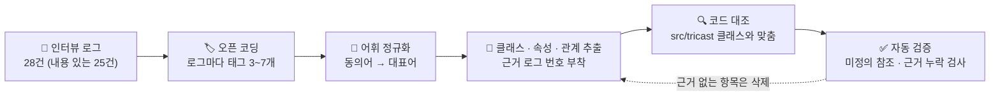
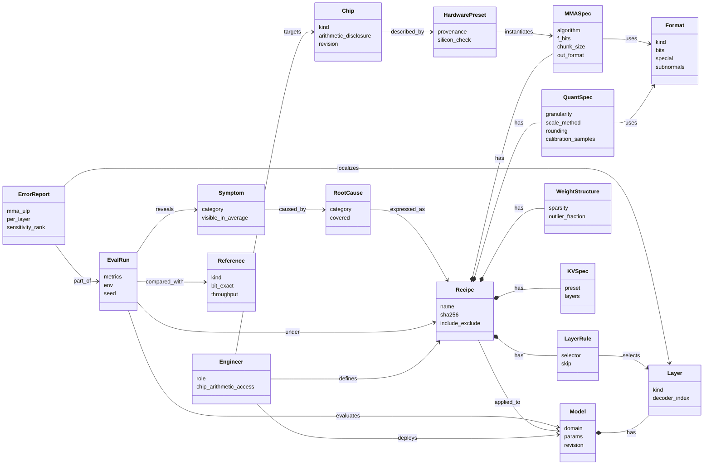
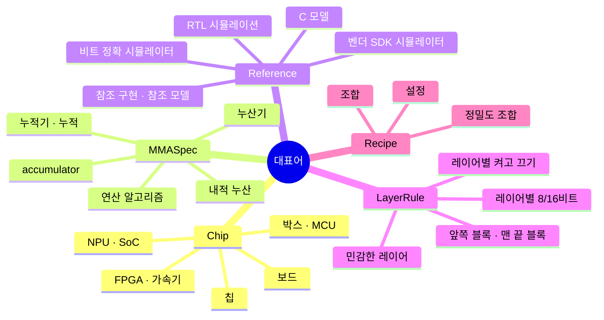
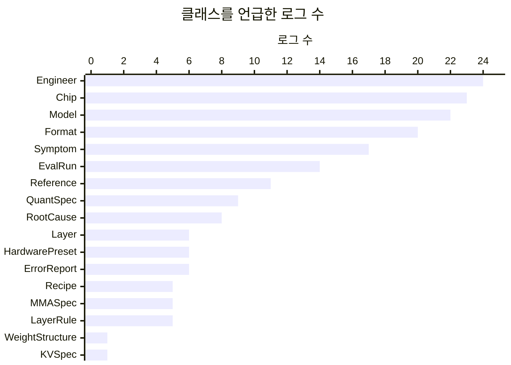
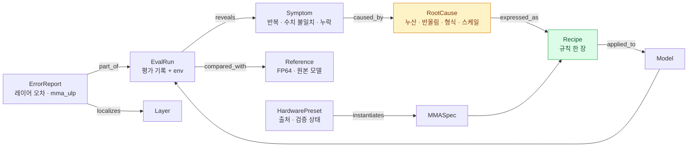
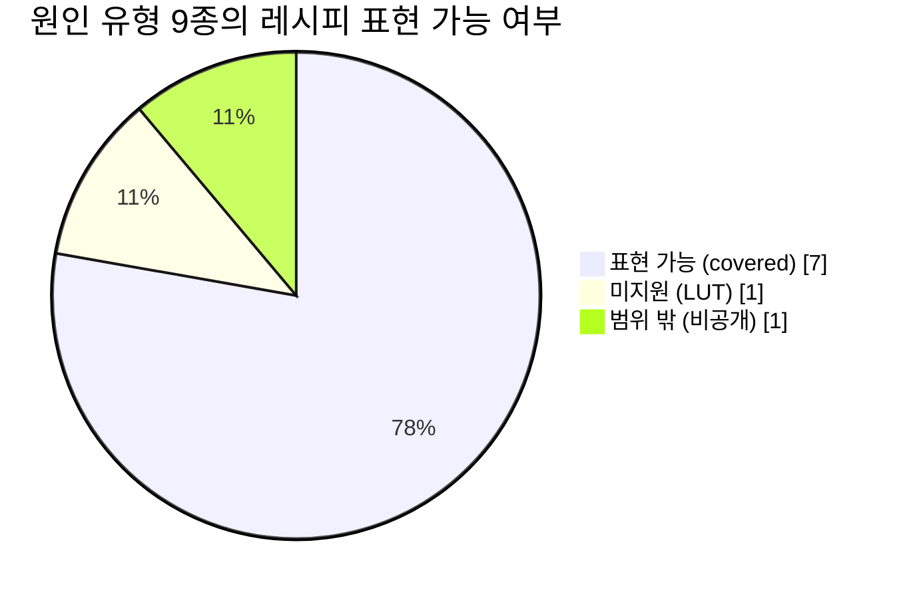

# 🕸️ TriCast 도메인 온톨로지

**Domain Ontology + 분석** · v1.0 · 2026-10-08

`클래스 17` `속성 51` `관계 25` `근거 인용 257건` `미정의 참조 0` `근거 없는 항목 0`

[문제 정의서](./PROBLEM.md) · [제품 스펙](./SPEC.md) · [인터뷰](./research/interviews.md) · [**온톨로지**](./ontology.md)

---

> [!NOTE]
> **이 문서는 무엇인가요?** 인터뷰에서 사람들이 쓴 말을 모아, TriCast가 다루는 세계의 **"단어장 + 관계도"** 로 정리한 문서입니다. 앞부분(§1–§7)은 어떻게 만들었고 무엇을 발견했는지에 대한 **분석**, 뒷부분(§8)은 그 결과인 **[`ontology.yaml`](./ontology.yaml)** 안내, 마지막(§9)은 자동 검증 결과입니다.

## 📌 한 줄 요약

**인터뷰 로그 25건 (응답 24 + 거절 사유 1)에서 나온 말을 17개 개념과 25개 관계로 정리했고, 모든 항목은 인터뷰 로그 번호로 되짚을 수 있습니다. 칩의 계산 규칙에 관한 개념(누산·원인·레이어 오차)은 "긍정" 응답자들에게서만 나왔습니다.**

### 🗺️ 쉽게 말하면 — 온톨로지는 "지도의 범례"

> 지도를 읽으려면 범례가 필요합니다. "파란 선 = 강, 빨간 선 = 도로". 온톨로지는 TriCast 세계의 범례입니다. 인터뷰에서 누구는 "누산기", 누구는 "누적기", 누구는 "accumulator"라고 했지만 **같은 것**이므로 하나의 이름(`MMASpec`)으로 묶고, "누산기 규칙은 레시피 안에 들어간다", "증상은 원인 때문에 생긴다" 같은 **관계**를 선으로 잇습니다. 이렇게 해 두면 코드·문서·대화가 같은 단어를 쓰게 됩니다.

| 핵심 숫자 | 값 |
|---|---:|
| 개념 (클래스) | **17** |
| 속성 / 관계 | 51 / 25 |
| 근거로 인용된 로그 | 23건 (긍정 14 · 잘 모르겠음 6 · 부정 2 · 무응답 1) |
| 근거 인용 총수 | 257건 |
| 근거가 한 로그뿐인 클래스 | 2개 (`WeightStructure` ← 02, `KVSpec` ← 13) — 다음 인터뷰에서 근거를 넓힐 대상 |
| 코드와 대응되는 클래스 | 13 / 17 (나머지 4개는 사람·현상이라 코드 객체가 없음) |

---

## 1. 만든 방법

| 단계 | 규칙 |
|---|---|
| 오픈 코딩 | 로그 원문에서 행동·도구·원인·비용을 가리키는 표현에 태그를 붙임 ([인터뷰 B-3](./research/interviews.md#b-3-전체-로그-28건)) |
| 어휘 정규화 | 같은 대상을 가리키는 다른 표현을 하나의 대표어로 묶음 (§3) |
| 추출 | 두 개 이상의 로그에서 나오거나, 원인·해결과 직접 연결된 것만 클래스로 올림 |
| 근거 규칙 | **모든 클래스·속성·관계는 `evidence: [로그 NN]`을 가진다.** 근거로 되짚을 수 없는 항목은 두지 않는다 |
| 의향 발언 제외 | "있으면 쓰겠다"류 발언(01·02 마지막 문장, 14 "돈 내고 씁니다")은 근거로 쓰지 않음 |
| 코드 대조 | 각 클래스에 `code:` 필드로 TriCast 저장소의 구현 위치를 적음. 코드에만 있는 어휘는 온톨로지 밖에 따로 둠 (§7) |

---

## 2. 한눈에 보기

17개 클래스는 세 묶음으로 나뉩니다.

| 묶음 | 질문 | 클래스 |
|---|---|---|
| 🧑‍🔧 **누가 · 무엇에** | 누가 어떤 칩·모델을 다루나? | `Engineer` · `Chip` · `Model` · `Layer` |
| 📄 **어떤 규칙으로** | 칩의 계산 규칙을 어떻게 적나? | `Recipe` · `Format` · `QuantSpec` · `MMASpec` · `HardwarePreset` · `WeightStructure` · `KVSpec` · `LayerRule` |
| 🔎 **무엇을 보고 판단하나** | 문제를 어떻게 발견하고 원인을 찾나? | `Symptom` · `RootCause` · `Reference` · `EvalRun` · `ErrorReport` |

`*--` = 구성(레시피의 일부) · `-->` = 연관. 다이어그램에는 관계 23개를 그렸고, 역방향 2개(`Layer belongs_to Model`, `HardwarePreset describes Chip`)는 YAML에만 적었습니다.

---

## 3. 어휘 정규화 — 같은 것을 다르게 부른 말들

| 대표어 | 인터뷰에서 쓰인 표현 (로그) | 주의할 혼동 |
|---|---|---|
| `Chip` | 칩(03), 보드(03·05), NPU(01·03·06), SoC(04), FPGA(11), 가속기(17), 박스(12·20), MCU급 보드(05) | GPU는 "흉내 낼 대상"(07: GPU 세대)일 수도, "흉내 내는 도구"일 수도 있음 → 대상일 때만 `Chip` |
| `MMASpec` | 누산기(03), 누적기(02), 누적(01), 내적 누산(07), 연산기(14), IEEE 연산 알고리즘(01) | "정밀도"는 `Format`, "누산 정밀도"는 `MMASpec.f_bits` |
| `Format` | 정밀도(01), 비트 폭(02), W8A8(03), INT8(04), FP8·E4M3(06), 4비트(07·10) | 8비트라도 INT8 / FP8 E4M3 / FP8 E4M3FNUZ는 모두 다른 `Format` |
| `QuantSpec.rounding` | 반올림(04), 라운딩(02), 버림(11), 짝수 쪽 반올림(04) | 원소 반올림(`QuantSpec.rounding`) ≠ 스케일 반올림(`ScaleSpec.rounding`) |
| `QuantSpec.granularity` | 채널별 스케일(05), 텐서 하나에 스케일 하나(05), 그룹 크기(11), 블록 스케일(07) | `channel` · `token`은 코드에서 `row`의 동의어 |
| `Reference` | C 모델(03·09), 비트 정확 시뮬레이터(09), 참조 구현(06), 정확한 참조 모델(06), 비트 정확 모델(24), RTL 시뮬레이션(06), SDK 시뮬레이터(08) | `pytorch_fakequant`도 비교 기준으로 쓰였지만 `bit_exact: false` |
| `LayerRule` | 이 레이어는 8비트 저 레이어는 16비트(09), 앞쪽 블록 두 개랑 맨 끝 블록(10), 민감한 레이어 16비트(14), 레이어별로 켜고 끄는 실험(13) | 실험용 on/off는 `LayerRule.skip`, 오차 분석은 `ErrorReport` |
| `RootCause` | 원인(03·04·06), "칩 최적화 이슈"(18) | 18의 표현은 원인 유형을 특정하지 않아 `category` 없음 |
| `Recipe` | 조합(07), 설정(11), 정밀도 조합(01) | 레시피 ≠ 프리셋 — 프리셋은 레시피의 `mma` 칸에 넣는 **값 묶음** |

---

## 4. 근거 분석

### 4-1. 클래스별 언급 빈도 (내용이 있는 로그 25건 중)

### 4-2. 클래스 × 로그 지도

> 🟩 긍정 로그에서 언급 · 🟨 잘 모르겠음 · 🟥 부정 · ⬜ 무응답(27 거절 사유) · `·` 언급 없음

| 클래스 | 01 | 02 | 03 | 04 | 05 | 06 | 07 | 08 | 09 | 10 | 11 | 12 | 13 | 14 | 15 | 16 | 17 | 18 | 19 | 20 | 21 | 22 | 23 | 24 | 27 | 합계 | 🟢 비율 |
|---|:-:|:-:|:-:|:-:|:-:|:-:|:-:|:-:|:-:|:-:|:-:|:-:|:-:|:-:|:-:|:-:|:-:|:-:|:-:|:-:|:-:|:-:|:-:|:-:|:-:|:-:|:-:|
| `Engineer` | 🟩 | 🟩 | 🟩 | 🟩 | 🟩 | 🟩 | 🟩 | 🟩 | 🟩 | 🟩 | 🟩 | 🟩 | 🟩 | 🟩 | 🟨 | 🟨 | 🟨 | 🟨 | 🟨 | 🟨 | 🟥 | 🟥 | 🟥 | 🟥 | · | **24** | 58% |
| `Chip` | 🟩 | 🟩 | 🟩 | 🟩 | 🟩 | 🟩 | 🟩 | 🟩 | 🟩 | 🟩 | 🟩 | 🟩 | 🟩 | 🟩 | 🟨 | 🟨 | 🟨 | 🟨 | 🟨 | 🟨 | 🟥 | · | · | 🟥 | ⬜ | **23** | 61% |
| `Model` | · | 🟩 | 🟩 | 🟩 | 🟩 | 🟩 | 🟩 | 🟩 | 🟩 | 🟩 | 🟩 | 🟩 | 🟩 | 🟩 | 🟨 | 🟨 | 🟨 | 🟨 | 🟨 | 🟨 | 🟥 | 🟥 | · | 🟥 | · | **22** | 59% |
| `Layer` | · | · | 🟩 | 🟩 | 🟩 | · | · | 🟩 | · | 🟩 | · | · | 🟩 | · | · | · | · | · | · | · | · | · | · | · | · | **6** | 100% |
| `Recipe` | 🟩 | 🟩 | 🟩 | · | · | · | 🟩 | · | · | · | 🟩 | · | · | · | · | · | · | · | · | · | · | · | · | · | · | **5** | 100% |
| `Format` | 🟩 | 🟩 | 🟩 | 🟩 | 🟩 | 🟩 | 🟩 | 🟩 | 🟩 | 🟩 | 🟩 | 🟩 | 🟩 | 🟩 | 🟨 | · | 🟨 | · | 🟨 | 🟨 | 🟥 | 🟥 | · | · | · | **20** | 70% |
| `QuantSpec` | · | 🟩 | · | 🟩 | 🟩 | · | 🟩 | · | 🟩 | · | 🟩 | 🟩 | · | 🟩 | · | · | · | · | · | · | 🟥 | · | · | · | · | **9** | 89% |
| `MMASpec` | 🟩 | 🟩 | 🟩 | · | · | · | 🟩 | · | 🟩 | · | · | · | · | · | · | · | · | · | · | · | · | · | · | · | · | **5** | 100% |
| `HardwarePreset` | · | · | · | 🟩 | · | 🟩 | 🟩 | · | · | · | · | · | 🟩 | 🟩 | · | · | · | · | · | · | · | · | · | 🟥 | · | **6** | 83% |
| `WeightStructure` | · | 🟩 | · | · | · | · | · | · | · | · | · | · | · | · | · | · | · | · | · | · | · | · | · | · | · | **1** | 100% |
| `KVSpec` | · | · | · | · | · | · | · | · | · | · | · | · | 🟩 | · | · | · | · | · | · | · | · | · | · | · | · | **1** | 100% |
| `LayerRule` | · | · | · | · | · | · | · | 🟩 | 🟩 | 🟩 | · | · | 🟩 | 🟩 | · | · | · | · | · | · | · | · | · | · | · | **5** | 100% |
| `Symptom` | · | · | 🟩 | 🟩 | 🟩 | 🟩 | 🟩 | 🟩 | 🟩 | 🟩 | 🟩 | 🟩 | 🟩 | 🟩 | 🟨 | 🟨 | 🟨 | 🟨 | · | 🟨 | · | · | · | · | · | **17** | 71% |
| `RootCause` | · | · | 🟩 | 🟩 | 🟩 | 🟩 | 🟩 | 🟩 | 🟩 | · | · | · | · | 🟩 | · | · | · | · | · | · | · | · | · | · | · | **8** | 100% |
| `Reference` | · | 🟩 | 🟩 | 🟩 | 🟩 | 🟩 | · | 🟩 | 🟩 | · | · | 🟩 | · | · | · | 🟨 | · | · | 🟨 | · | · | · | · | 🟥 | · | **11** | 73% |
| `EvalRun` | · | · | 🟩 | 🟩 | · | 🟩 | 🟩 | · | 🟩 | 🟩 | 🟩 | 🟩 | 🟩 | · | · | 🟨 | 🟨 | 🟨 | 🟨 | · | 🟥 | · | · | · | · | **14** | 64% |
| `ErrorReport` | 🟩 | 🟩 | 🟩 | · | · | · | 🟩 | · | · | 🟩 | · | · | 🟩 | · | · | · | · | · | · | · | · | · | · | · | · | **6** | 100% |

### 4-3. 발견

> [!IMPORTANT]
> **① 칩 계산 어휘는 1차 사용자에게서만 나옵니다.** `MMASpec` · `RootCause` · `Layer` · `ErrorReport` · `LayerRule` · `Recipe`는 **긍정 로그에서만(100%)** 언급됐습니다. 반대로 `Engineer` · `Chip` · `Model`처럼 누구나 쓰는 말은 긍정 비율이 58~61%로 전체 판정 비율(58%)과 같습니다. → 온톨로지의 **핵심 규칙 묶음은 1차 사용자의 언어**에서 나왔다는 뜻이고, 이는 [문제 정의서의 대상 정의](./PROBLEM.md#2-대상과-비대상)를 뒷받침합니다.

| 판정 그룹 | 로그 수 | 로그당 평균 개념 수 |
|---|:-:|:-:|
| 🟢 긍정 | 14 | **9.6** |
| 🟡 잘 모르겠음 | 6 | 5.5 |
| 🔴 부정 | 4 | 3.8 |

**② 증상(`Symptom`)은 17건인데 원인(`RootCause`)은 8건뿐입니다.** 차이를 본 사람의 절반 이상이 원인까지 가지 못했습니다. 이 빈칸이 TriCast가 `ErrorReport`(레이어 오차 · `mma_ulp`)와 `same_quant_fp64` 비교 기준으로 메우려는 자리입니다.

**③ `Reference`(비교 기준)가 11건으로 많습니다.** 사람들은 "무엇과 비교해야 맞는지"를 계속 고민했습니다(06: 정답 기준을 직접 만들고 1주 검증, 16: 책임을 가릴 기준이 없음). 그래서 `EvalRun`은 반드시 `env`(실행 환경)를 가져야 근거가 된다는 규칙을 온톨로지에 넣었습니다.

**④ 근거 로그가 1건인 클래스 2개** — `WeightStructure`(02)와 `KVSpec`(13). 코드에는 검증·구현되어 있고, 다음 인터뷰에서 희소성·이상치·KV 캐시를 다루는 사용자를 섭외해 근거를 넓힙니다.

---

### 4-4. 클래스별 근거 대목 — 각 개념이 인터뷰의 어느 대목에서 왔나

따옴표는 [인터뷰 로그 표](./research/interviews.md#b-3-전체-로그-28건)의 원문, `코드체`는 같은 행의 오픈 코딩 태그다. 각 로그는
그 클래스의 `evidence` 에 들어 있다 (`tests/test_ontology.py` 가 원문 · 태그 · 번호를 대조한다).

| 클래스 | 로그 | 대목 |
|---|:-:|---|
| `Engineer` | 09 · 24 | "원인은 아는데 빨리 보여 드릴 수단이 없으니까요" · "칩 세대가 바뀔 때마다 여섯 명이 석 달을 씁니다" |
| `Chip` | 05 · 14 | "칩이 채널별 스케일을 지원 안 해요. 텐서 하나에 스케일 하나" · "벤더가 내부 산술을 공개 안 하거든요" |
| `Model` | 03 · 10 | `PPL12→30+` · "PC 결과랑 폰 결과가 순위부터 안 맞는다는 거예요" |
| `Layer` | 10 · 13 | `200곳전수탐색` · `레이어별on/off` |
| `Recipe` | 07 | "sweep하고 싶은 조합은 서른 개가 넘는데 실제로 돌린 건 여섯 개입니다" (조합 → `Recipe`) |
| `Format` | 06 | "같은 E4M3라도 … 최대 표현값이 240과 448로 갈립니다" |
| `QuantSpec` | 04 · 05 | "PC 시뮬레이션은 중간값을 짝수 쪽으로 반올림하는데, 칩은 … 아래 비트를 그냥 버리고 있었습니다" (`rounding`) · "텐서 하나에 스케일 하나" (`granularity`) |
| `MMASpec` | 03 · 01 | "fake-quant는 … 내적은 fp32로 더하니까, 그 손실이 시뮬레이션에 아예 안 잡혀요" · `누산기비트폭` · `누산알고리즘` |
| `HardwarePreset` | 07 · 24 | `GPU세대차` · `누산정밀도·묶음` · `비트정확모델선행` |
| `WeightStructure` | 02 | "비트 폭 하나 바꾸고, 희소 비율 하나 틀고, 이상치 보존 방식 하나 수정할 때마다 CUDA 커널을 다시 깎아야 합니다" |
| `KVSpec` | 13 | "컨텍스트가 8k 토큰을 넘는 요청에서만 답이 문맥을 놓쳤습니다" · `KV캐시` |
| `LayerRule` | 09 · 13 | `수동혼합정밀도` · `레이어별on/off` |
| `Symptom` | 03 · 08 | `PPL12→30+` · `LUT근사` 가 낸 증상 — 페인 열 "숫자를 틀림" |
| `RootCause` | 04 · 06 | `반올림불일치` · `FP8특수값` · `서브노멀` |
| `Reference` | 03 · 09 · 06 | `C모델20분` · `C모델느림` · `참조모델부재` |
| `EvalRun` | 16 · 18 | "누구 책임인지 가릴 기준이 없다는 거죠" · "원인을 모르니 리스크를 숫자로 못 올리잖아요" |
| `ErrorReport` | 01 · 10 | `ULP오차` · `200곳전수탐색` |

어휘 정규화(§3)의 표현 일부와 속성 예시 일부(예: `Chip.memory_budget` 의 메모리 크기)는 로그 표의 한 줄 인용이 아니라 같은
응답자의 인터뷰 기록 원문(「TriCast 인터뷰 사례 모음집」)에서 가져왔다.

## 5. 진단 루프 — 증상에서 레시피로

온톨로지의 핵심 흐름은 "칩에서 이상한 결과를 봤다 → 원인 규칙을 찾는다 → 그 규칙을 레시피로 적는다 → 다시 평가한다"의 반복입니다.

**`RootCause.category` 별 범위 확인** — 원인이 레시피로 표현되는지가 TriCast가 도울 수 있는지를 결정합니다.

| 원인 유형 | 로그 | 레시피 축 (`expressed_as`) | `covered` | 코드 상태 |
|---|---|---|:-:|:-:|
| `accumulator_width` | 01 02 03 09 | `mma.f_bits` · `chunk_size` · `c_mode` | ✅ | 검증 |
| `gpu_generation_accumulation` | 07 | `mma: <preset>` | ✅ | 검증 (프리셋 칩 확인은 일부) |
| `rounding` | 04 09 11 | `rounding: rtz` 등 | ✅ | 검증 |
| `special_values` | 06 | `format: "e4m3:fnuz:…:nosub"` | ✅ | 검증 |
| `scale_granularity` | 05 | `granularity: tensor` | ✅ | 검증 |
| `outlier_sparsity` | 02 | `sparsity` · `outliers` | ✅ | 검증 |
| `kv_cache` | 13 | `kv` | ✅ | 구현 |
| `activation_lut` | 08 | — | ❌ | 없음 |
| `undisclosed_arithmetic` | 09 14 16 (+27) | — (규칙을 모르면 적을 수 없음) | ❌ | 범위 밖 |

---

## 6. 코드 정합성 — 온톨로지 ↔ TriCast 코드

| 클래스 | 코드 위치 (`src/tricast/`) | 상태 | 근거 로그 수 |
|---|---|:-:|:-:|
| `Engineer` | — (사람) | — | 24 |
| `Chip` | — (규칙은 `HardwarePreset`·`Recipe`로 들어옴) | — | 23 |
| `Model` | `nn.patch.patch_model`의 입력 | 🟡 | 22 |
| `Layer` | `nn.EmuLinear` · `nn.EmuConv2d` · `nn.attention` · `kv` | ✅ / 🟡 | 6 |
| `Recipe` | `recipe.Recipe` (YAML · dict · sha256) | 🟡 | 5 |
| `Format` | `formats` (등록 20종 + 사용자 정의) | ✅ | 20 |
| `QuantSpec` | `quant.spec.QuantSpec` · `ScaleSpec` · `ObserverSpec` | ✅ | 9 |
| `MMASpec` | `mma.spec.MMASpec` · `kernels.mma` · `reference.mma` | ✅ | 5 |
| `HardwarePreset` | `mma.spec.PRESETS` (8종, `provenance`) | 🟠 | 6 |
| `WeightStructure` | `quant.structure.SparsitySpec` · `OutlierSpec` | ✅ | 1 |
| `KVSpec` | `quant.spec.KVSpec` · `kv` | 🟡 | 1 |
| `LayerRule` | `Recipe.overrides` (`match` · `layers` · `modules` · `skip`) | 🟡 | 5 |
| `Symptom` | — (현상, `EvalRun.metrics`로 측정) | — | 17 |
| `RootCause` | — (원인, `Recipe`로 표현) | — | 8 |
| `Reference` | `reference` (fp64 · int64 · Fraction) · 비교 기준 `native` / `same_quant_fp64` | ✅ | 11 |
| `EvalRun` | `eval.runner` · `eval.envinfo.capture_env` | 🟡 | 14 |
| `ErrorReport` | `analysis.layer_report` · `ulp_error` | 🟡 | 6 |

상태: ✅ 검증됨 · 🟡 구현됨 · 🟠 부분 (`support_matrix.yaml` 기준). 사람·현상을 나타내는 4개 클래스는 코드 객체가 없는 것이 정상입니다.

---

## 7. 온톨로지 밖에 둔 것

### 7-1. 코드에는 있지만 인터뷰 근거가 없는 어휘

근거 규칙에 따라 아래는 **온톨로지 클래스로 올리지 않았습니다.** 대신 다음 인터뷰에서 확인할 질문을 붙였습니다.

| 코드 어휘 | 위치 | 다음 인터뷰에서 확인할 것 |
|---|---|---|
| `TransformSpec` (Hadamard · SmoothQuant · AWQ) | `quant/spec.py` · `transforms.py` | 양자화 전처리를 칩 배포 때 실제로 쓰나? |
| `WeightAlgoSpec` (GPTQ) | `weight_quant/gptq.py` | 가중치 반올림 알고리즘이 칩 차이 원인 분석에 영향을 주나? |
| `zero_point` · 2단계 스케일 (NVFP4) | `quant/spec.py` | 비대칭 양자화·이중 스케일을 쓰는 칩이 있나? |
| `ObserverSpec` (ema · history) | `quant/spec.py` | 정적 스케일을 쓰는 칩 배포가 있나? (21은 보정 이미지 300장만 언급) |
| `promote_interval` (FP32 승격) | `mma/spec.py` | 소프트웨어로 누산을 넓히는 우회를 하나? (13의 "소프트웨어 우회"와 관련 가능) |
| `rounding: sr` (확률적 반올림) | `rounding.py` | 학습·QAT 중에 쓰나? (12의 QAT와 관련 가능) |
| `EmulationRequest` (자연어 요청) | `agent/request.py` | — 사용 방식에 관한 것이라 도메인 온톨로지 대상 아님 |

### 7-2. 인터뷰에는 있지만 코드에 없는 개념 (빈틈)

| 인터뷰 개념 | 로그 | 상태 | 제안 |
|---|---|---|---|
| 활성함수 표(LUT) 근사 | 08 | 코드 없음 | `Layer.kind = activation_fn`을 레시피 축으로 — 다음 버전 후보 |
| 정수 재양자화(시프트 후 버림) 경로 | 04 | `rounding: rtz`로 일부만 표현 | 누산 후 재양자화 단계를 별도 규칙으로 둘지 검토 |
| 평균에 안 보이는 실패 (긴 문맥 · 작은 물체) | 05 13 | 평균 지표 위주 | 문맥 길이·물체 크기 구간별 지표를 `EvalRun.metrics`에 |
| 칩 리비전 이력 | 04 14 | `HardwarePreset`에 버전 필드 없음 | `Chip.revision`과 프리셋의 연결 방식 정의 |

---

## 8. `ontology.yaml`

> 형식: 과제 템플릿의 `ontology.yaml` 형식을 그대로 따르고, 각 클래스에 `code:`(구현 위치) 필드를 추가했습니다. `#` 주석의 `'A' = 'B' → 대표어 X`는 §3의 어휘 정규화 결과입니다.

정본은 [`docs/ontology.yaml`](./ontology.yaml)입니다. 이 절에 있던 YAML 전문은 두 벌이 어긋나지 않도록 그 파일로 옮겼습니다.

---

## 9. 자동 검증

`ontology.yaml`은 [`tests/test_ontology.py`](../tests/test_ontology.py)가 매 테스트 실행마다 검사합니다 — 모든 클래스·속성·관계에 근거가 있는지, 근거 로그 번호가 [인터뷰 로그 표](./research/interviews.md#b-3-전체-로그-28건)에 실제로 있는지, 관계 대상이 정의된 클래스인지.

| 검사 | 결과 |
|---|:-:|
| 클래스 / 속성 / 관계 수 | 17 / 51 / 25 |
| 미정의 클래스를 가리키는 관계 | **0** ✅ |
| 근거가 없는 클래스 · 속성 · 관계 (키 속성 제외) | **0** ✅ |
| 형식이 잘못된 근거 (`로그 NN`, 01–28 밖) | **0** ✅ |
| 인용된 로그 | 23건 / 근거 인용 총 257건 (클래스 · 속성 · 관계, `scope` 제외) |
| 가장 많이 인용된 로그 | 03 (38회) · 07 (29회) · 06 (23회) · 05 (18회) · 13 (18회) |
| 인용되지 않은 로그 | 22 · 23 (부정 — 칩 배포·양자화 경험 없음), 25 · 26 · 28 (무응답) → 내용상 자연스러움 |
| 근거 로그가 1건인 클래스 | `WeightStructure` (02) · `KVSpec` (13) → 다음 인터뷰에서 근거 확대 |

---

## 10. 다음 단계

| 대상 | 다음 단계 |
|---|---|
| `WeightStructure` · `KVSpec` (근거 로그 각 1건) | 희소성·KV 캐시를 다루는 사용자 2명 이상을 v2 프로토콜로 인터뷰해 근거를 넓힌다 |
| 클래스 추출 | 두 번째 코더가 같은 로그를 독립 코딩해 일치도를 잰다 |
| 코드 어휘 7종 (§7-1) | §7-1의 질문으로 근거를 찾고, 근거가 없으면 "코드 전용"으로 유지한다 |

---

출처: 팀 인터뷰 기록 28건 (「TriCast 인터뷰 사례 모음집」) · TriCast 저장소 코드 `github.com/Youngmin17/TriCast` (`src/tricast/**`, `support_matrix.yaml`).
