

# 🎙️ TriCast 인터뷰 · 관찰 · Job Story

**사용자 조사 기록** · v1.0 · 2026-10-08

`섭외 28명` `응답 24명` `긍정 14명` `원인 규명·재튜닝 기간 중앙값 30일` `코드 기준 TriCast main`

[문제 정의서](../PROBLEM.md) · [제품 스펙](../SPEC.md) · **인터뷰** · [온톨로지](../ontology.md)

---

> [!NOTE]
> **이 문서는 무엇인가요?**
> TriCast라는 도구를 만들기 전에, "정말 이런 문제가 있는가?"를 사람들에게 직접 물어본 기록입니다.
> 누구에게 무엇을 물었는지(A), 무엇을 들었는지(B), 일하는 과정이 어땠는지(C), 그래서 사람들이 진짜 원하는 일은 무엇인지(D)를 순서대로 정리했습니다.

## 📌 한 줄 요약

**응답자 24명 중 19명이 "그때 모델 출력이 예상과 달랐다"(Q2)고 답했고, 칩 계산 접근도가 0.5를 넘는 15명 (B-6) 중 13명은 그 차이를 칩에 올린 뒤에 겪은 사례나 반복 비용을 말했습니다. 원인을 찾거나 다시 튜닝하는 데는 보통 한 달(중앙값 30일)을 썼습니다.** 원인을 찾은 사람들이 공통으로 짚은 것은 "PC의 흉내 계산이 칩의 실제 계산 방식을 따라 하지 못한다"는 점이었습니다.

| 핵심 숫자 | 값 | 무엇을 뜻하나요 |
|---|---:|---|
| 출력이 예상과 달랐던 사람 (Q2 Yes) | **19 / 24명** (79%) | 문제가 드물지 않다 |
| 칩 계산 접근도 0.5 초과 15명 중 칩 투입 후 사례·반복 비용을 말한 사람 | **13 / 15명** (87%) | [문제 정의서 §4-1](../PROBLEM.md#4-1-문제의-실재-인터뷰-증거로-지금-판정)의 넓은 기준 (엄격 기준 8 / 15명, 53%) |
| 원인까지 찾아낸 사람 | **9명** | 원인은 모두 "칩의 계산 규칙" 쪽이었다 |
| 원인을 못 찾고 오래 튜닝한 사람 | **5명** | 3주~3개월을 썼다 |
| 해결·지연 기간 중앙값 (기간을 말한 11명) | **30일** | 범위 10~90일, 합계 404일 |
| 사분면 ① (칩 계산 접근도와 문제 강도가 모두 높은 구역) | **12명** | 1차 사용자 — B-6 점수 규칙으로 정한 구역 |

<b>📖 먼저 알아두면 좋은 용어 7개 (펼치기)</b>

| 용어 | 쉽게 말하면 | 비유 |
|---|---|---|
| **양자화** | AI 모델 안의 숫자를 더 짧은 자릿수로 줄여 모델을 작고 빠르게 만드는 것 | 고화질 사진을 저화질로 줄여 용량을 아끼기 |
| **칩 (NPU)** | AI 계산만 전문으로 하는 반도체. 휴대폰·가전·자동차에 들어간다 | AI 전용 계산기 |
| **누산기** | 곱한 값들을 계속 더해 가며 합을 적어 두는 칸. 칸이 좁으면 작은 자릿수를 버린다 | 계산기의 메모장 (칸 수가 칩마다 다름) |
| **반올림 방식** | 표현할 수 없는 값을 어느 쪽으로 맞출지 정한 규칙 (0.5를 올릴지, 버릴지 등) | 시험 점수 반올림 규칙이 학교마다 다른 것 |
| **fake-quant** | PC에서 양자화를 "흉내" 내는 일반적인 방법. 곱한 뒤 더하기는 넉넉한 정밀도로 해서 칩과 달라진다 | 연습장은 넓은 종이, 실전은 좁은 종이 |
| **비트 정확 (bit-exact)** | 결과의 0과 1 하나까지 칩과 똑같은 것 | 복사본이 원본과 픽셀 하나까지 같은 것 |
| **PPL (perplexity)** | 언어모델이 다음 단어를 얼마나 헷갈려하는지 나타내는 점수. 낮을수록 좋다 | 객관식 문제에서 찍는 보기 개수 |

---

## A. 인터뷰 프로토콜

### A-1. 실제로 사용한 프로토콜 (v1 · 3문항)

- **대상 (누구를, 왜)**: 양자화한 AI 모델을 칩에 올려 본 개발자. 직접 해 본 사람이어야 "그때 무슨 일이 있었는지"를 구체적으로 다시 떠올릴 수 있기 때문입니다.
- **알아내려는 것 (틀릴 수 있는 가설)**: *개발 환경(PC)에서 멀쩡하던 양자화 모델이 칩에서 다르게 동작한 경험이 흔하고, 그 원인은 모델이 아니라 칩의 계산 방식에 있으며, 원인을 찾는 데 큰 비용이 든다.*
- **질문 3개와 의도**

| # | 질문 | 의도 | 기대한 답의 갈래 |
|---|---|---|---|
| Q1 | 가장 최근 양자화 관련 개발을 하신 경험이 있나요? 어떤 경험이었나요? | 경험 유무와 목적 확인 | 메모리·성능·전력 등 목적 |
| Q2 | 그때 실제 모델 출력이 예상과 달랐던 경험이 있나요? | 문제를 실제로 겪었는지 확인 | Yes / No |
| Q3 | 그 차이를 어떻게 해결하셨나요? 불편한 점은 무엇이었나요? | 구체적인 해결 과정과 비용 | 원인 식별 / 장기 튜닝 / 모르겠다 |

- **판정 기준 (4가지)**

| 판정 | 기준 |
|---|---|
| 🟢 **긍정** | Q2가 Yes이고, Q3에서 원인을 찾았거나 오래 튜닝한 과거 사례를 구체적으로 말함 |
| 🟡 **잘 모르겠음** | 차이를 봤거나 의심하지만 원인과 해결 과정을 설명하지 못함 |
| 🔴 **부정** | 양자화 경험이 없거나, 출력이 예상과 다르지 않았음 |
| ⚪ **무응답** | 인터뷰가 성사되지 않음 |

### A-2. 보완한 프로토콜 (v2 · 5문항) — 다음 인터뷰부터 사용

v1을 돌려 보고 발견한 빈틈 4가지(B-9 참고)를 반영해 다시 썼습니다.

- **대상 (행동 조건 포함)**: 최근 1년 안에 양자화 모델을 **실제 칩(NPU·FPGA·SoC)에 올렸거나 칩 연산기 사양을 정하는 데 참여했고**, 칩의 계산 규칙(누산·반올림·스케일)을 **직접 다루는** 엔지니어와 연구자. 섭외할 때 "칩 계산 사양을 직접 보시나요?"를 먼저 묻습니다.
- **가설 (틀릴 수 있게)**: *양자화 품질 문제의 진짜 비용은 정확도 손실 자체가 아니라, 개발 환경이 칩의 계산을 재현하지 못해 **칩에 올린 뒤에야** 차이를 발견하고 원인을 찾는 데 **수 주**를 쓰는 것이다.* → 대상 사용자 중 이런 사례가 30% 미만이면 가설을 버립니다.
- **질문 5개 — 모두 과거 행동을 묻는 형태**

| # | 질문 | 의도 |
|---|---|---|
| 1 | 가장 최근에 양자화한 모델을 칩에 올렸던 때 이야기를 들려주세요. 어떤 모델, 어떤 칩, 몇 비트였나요? | 구체적인 과거 사건으로 시작 |
| 2 | 그때 칩의 출력과 개발 환경의 출력을 **직접 비교해 보셨나요?** 어떻게 비교하셨나요? | "비교해 본 적 없음"을 "차이 없음"과 구분 (v1의 19번 오분류 방지) |
| 3 | 차이가 있었다면 어떤 증상이었고, 원인을 찾기까지 **무엇을 어떤 순서로** 하셨나요? 얼마나 걸렸나요? | 실제 작업 흐름과 비용 |
| 4 | 그 과정에서 칩의 계산 사양(누산·반올림·스케일)은 **어디서 얻으셨나요?** | 사양 접근성 — TriCast 레시피를 쓸 수 있는 사람인지 |
| 5 | 결국 어떻게 마무리하셨고, 다음 칩이나 리비전에서 **다시 해야 했던 일**은 무엇이었나요? | 말이 아닌 최종 행동과 반복 비용 |

- **특히 조심할 유도 질문**

| ❌ 피할 질문 | 왜 안 되나요 | ✅ 바꾼 질문 |
|---|---|---|
| "칩 계산을 레시피로 정의해 GPU에서 똑같이 돌려 주는 도구가 있으면 쓰시겠어요?" | 미래·가정·해결책 설명. "네 좋죠"는 정보가 아님 | "지난번 칩에서 차이가 났을 때 원인을 확인하려고 무엇을 하셨어요?" |
| "칩에서 출력이 달랐던 적 있으시죠?" | 답을 정해 놓은 유도 | "칩 출력과 개발 환경 출력을 비교해 보신 적이 있나요?" |

- **원칙**: 인터뷰가 끝나도 상대는 TriCast를 모릅니다. 우리 아이디어를 설명하지 않습니다.

---

## B. 인터뷰 로그

### B-1. 응답 현황 — 28명에게 연락해 24명과 대화했습니다

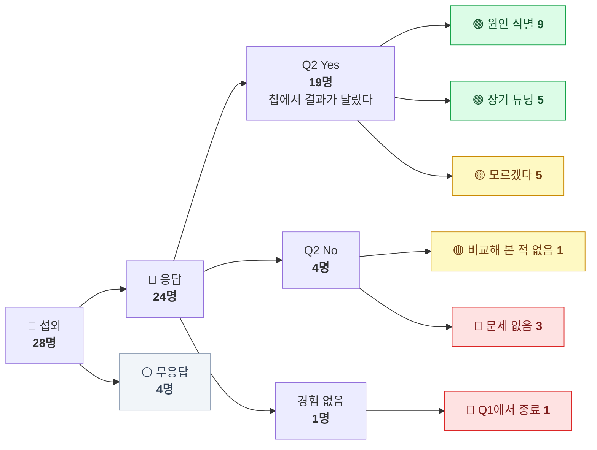

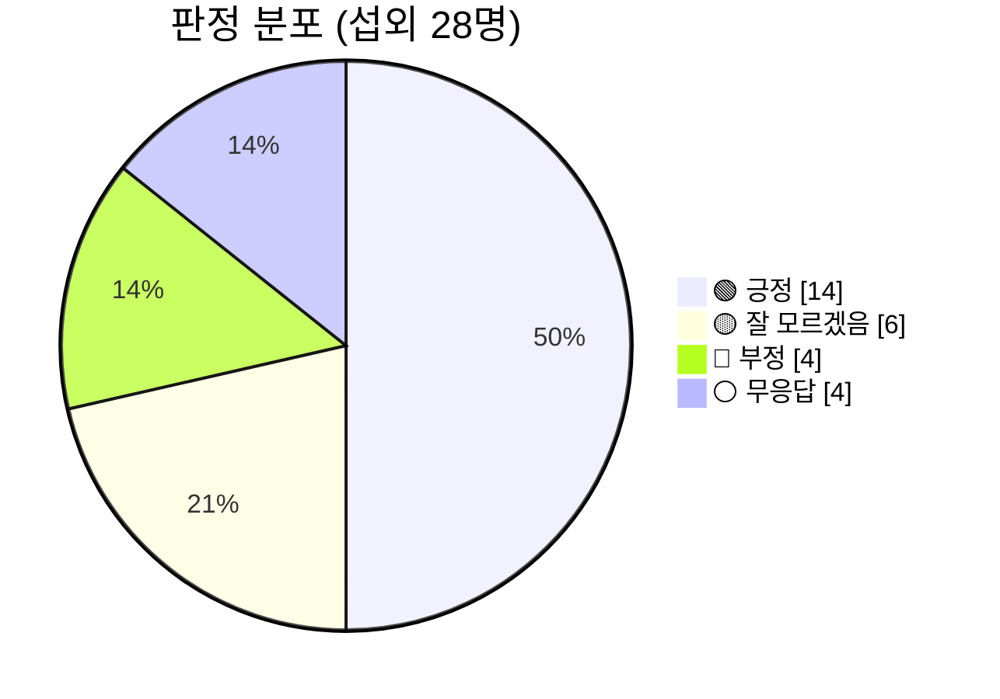

> [!TIP]
> **쉽게 읽기**: 대화한 24명 중 절반이 넘는 14명(58%)이 "문제를 겪었고, 그 과정을 구체적으로 말할 수 있다"는 쪽이었습니다. "잘 모르겠음" 6명은 대부분 문제를 보긴 했지만 원인을 파고들 수 있는 위치(주니어, 포팅 담당, PM, 학생)가 아니었습니다.

### B-2. 응답자 프로필

| 항목 | 분포 | 메모 |
|---|---|---|
| 인터뷰 시간 (기록한 14건) | 합계 **455분**, 평균 32.5분 | |
| 경력 (연차를 밝힌 18명) | 1년 ~ 19년, **중앙값 7.5년** | 박사과정·박사후·창업자·학부생 4명은 별도 |
| 다룬 모델 (24명) | LLM 16 · 음성 3 · 비전 2 · 비전+LLM 1 · 범용(NPU) 1 · 없음 1 | 음성 3건(04·16·18)은 이후 "음성 평가" 범위의 근거 |
| 양자화 형식 (밝힌 18명) | INT8 7 · 4비트 6 · FP8 3 · 8비트(형식 미상) 2 · 4·8비트 혼용 1 | 4비트 6건 중 1건(07)은 FP8도 함께 다룸 |
| 기록 | 01~28 모두 팀이 직접 진행한 인터뷰, 「TriCast 인터뷰 사례 모음집」으로 정리 | 핵심 인용은 응답자의 말 그대로 |

### B-3. 전체 로그 (28건)

> 판정: 🟢 긍정 · 🟡 잘 모르겠음 · 🔴 부정 · ⚪ 무응답 · 일시는 팀 기록에서 채운다

| # | 일시 | 대상 (역할) | 핵심 인용 | 태그 (오픈 코딩) | 도출된 페인 | 판정 |
|---|---|---|---|---|---|:-:|
| 01 |  | NPU 개발자 | "GPU 세대에 따라서 커널 작업을 반복적으로 해야하고, 알고리즘 묘사와 정밀도 조합에 따라서도 마찬가지다" | `누산알고리즘` `ULP오차` `커널재작성` `면적·전력` | 누산 방식에 따른 미세 오차가 칩 면적·전력 설계를 좌우하는데, 조합·GPU 세대마다 검증 커널을 다시 짠다 | 🟢 |
| 02 |  | NPU 개발자 | "비트 폭 하나 바꾸고, 희소 비율 하나 틀고, 이상치 보존 방식 하나 수정할 때마다 CUDA 커널을 다시 깎아야 합니다" | `fake-quant한계` `이상치` `N:M희소` `누적기ULP` `커널재작성` | PyTorch 흉내로는 실제 칩 동작을 보장 못 함 / 설계 변수 하나 바꿀 때마다 커널 재작성 | 🟢 |
| 03 |  | NPU 개발자 | "fake-quant는 … 내적은 fp32로 더하니까, 그 손실이 시뮬레이션에 아예 안 잡혀요" | `PPL12→30+` `누산기비트폭` `C모델20분` `CUDA재작성` | 칩의 좁은 누산기 손실이 PC에서 안 보임 / 원인 규명 2주 / 다음 칩에서 또 작성 | 🟢 |
| 04 |  | 온디바이스 AI 개발자 | "PC 시뮬레이션은 중간값을 짝수 쪽으로 반올림하는데, 칩은 … 아래 비트를 그냥 버리고 있었습니다" | `반올림불일치` `사양문서부재` `문의3회` `리비전재작업` | 1칸 미만 차이가 수십 레이어에서 한쪽으로 쌓여 같은 말 반복 / 사양이 문서에 없어 3번 문의 | 🟢 |
| 05 |  | 임베디드 AI 개발자 | "칩이 채널별 스케일을 지원 안 해요. 텐서 하나에 스케일 하나" | `스케일단위` `벤더툴무경고` `보드40분루프` | 작은 물체 검출 누락 / 변환 툴이 경고 없이 바꿈 / 보드에 구워야 확인(회당 40분) | 🟢 |
| 06 |  | 반도체 검증 엔지니어 | "같은 E4M3라도 … 최대 표현값이 240과 448로 갈립니다" | `FP8특수값` `서브노멀` `참조모델부재` | 평가 문장 200개 중 37개에서 최종 단어가 다름 / 정답 기준을 직접 만들고 또 검증 (3주 + 1주) | 🟢 |
| 07 |  | AI 반도체 연구자 | "sweep하고 싶은 조합은 서른 개가 넘는데 실제로 돌린 건 여섯 개입니다" | `GPU세대차` `누산정밀도·묶음` `역추정` `실험당4일` | 문서에 없는 누산 방식을 랜덤 벡터로 역추정 / 후보마다 커널 → 실험 1개 4일 → 설계 공간의 20% 이하만 탐색 | 🟢 |
| 08 |  | 온디바이스 AI 개발자 | "NPU가 GELU랑 softmax를 … 256칸짜리 표에서 찾아오는 거였어요" | `LUT근사` `SDK시뮬미재현` `CPU우회` | 숫자를 틀림 / 벤더 시뮬레이터도 재현 못 함 / 우회 결과 속도 30% 손실 | 🟢 |
| 09 |  | 반도체 기술지원 엔지니어 | "원인은 아는데 빨리 보여 드릴 수단이 없으니까요" | `분기20건` `시뮬≠칩` `C모델느림` `수동혼합정밀도` | 문의의 절반이 계산 규칙 차이 / C 모델은 문장당 몇 분 → 고객과 한 달씩 수동 조정 | 🟢 |
| 10 |  | 모바일 AI 개발자 | "PC 결과랑 폰 결과가 순위부터 안 맞는다는 거예요" | `원인미특정` `200곳전수탐색` `반나절루프` `3개월` | PC에서 한 민감도 분석이 칩에서 쓸모없음 / 1회 반나절 × 반복 = 3개월 | 🟢 |
| 11 |  | AI 연구자 | "FPGA 쪽은 반올림을 버림으로 하는데, 그걸 제 코드에 반영한 게 한참 뒤였어요" | `수작업코드` `보정·스케일튜닝` `실험무효` | 설정마다 코드 수정·재검증 / 칩 규칙 미반영으로 2개월 실험이 무의미 | 🟢 |
| 12 |  | 임베디드 개발자 | "박스에서 나온 숫자를 PC에서 똑같이 만들어 볼 수가 없다는 거요" | `숫자명령오류` `클리핑튜닝` `QAT4회` | 정확도 96% → 89%, 재학습 4회(회당 3일) 뒤 91%로 출시 / PC 재현 불가 | 🟢 |
| 13 |  | AI 서빙 개발자 | "컨텍스트가 8k 토큰을 넘는 요청에서만 답이 문맥을 놓쳤습니다" | `KV캐시` `평균에안보임` `레이어별on/off` `5주` | 평균 점수로는 안 보이는 긴 문맥 실패 / 실험 1회 수 시간 / 절감 폭이 계획의 절반 | 🟢 |
| 14 |  | 스타트업 창업자 | "벤더가 내부 산술을 공개 안 하거든요" | `벤더교체` `산술비공개` `3주재튜닝` `발주리스크` | 칩을 바꾸기 전에 품질을 예측할 수 없어 3주짜리 위험을 안고 발주 | 🟢 |
| 15 |  | AI 개발자 | "양자화 때문이었는지도 확실하지 않습니다" | `원인모름` `역할상비접근` | 차이는 봤지만 원인을 파고들 경로가 없음 | 🟡 |
| 16 |  | 임베디드 개발자 | "누구 책임인지 가릴 기준이 없다는 거죠" | `책임공방` `판정기준부재` `메일2주` | 모델팀과 칩 벤더 사이에서 판정 기준 없이 2주 | 🟡 |
| 17 |  | 학생 개발자 | "측정을 따로 한 건 아니라서 '느낌'이라고밖에 못 쓰겠네요" | `측정부재` `프롬프트우회` | 품질 저하를 잴 수단이 없음 | 🟡 |
| 18 |  | 제품 기획자 | "원인을 모르니 리스크를 숫자로 못 올리잖아요" | `일정6주지연` `리스크정량화불가` | 6주 지연, 해결 날짜를 아무도 못 줌 | 🟡 |
| 19 |  | AI 개발자 | "'달랐던 경험이 없다'가 아니라 '달랐는지 모른다'가 정확한 답이겠네요" | `칩비교미실시` `평가보드부족` | 시뮬레이션 숫자만 넘기고 칩과는 비교하지 않음 | 🟡 |
| 20 |  | MLOps 엔지니어 | "temperature 낮추고, 출력 검사해서 깨지면 다시 뽑게 했어요" | `JSON깨짐` `재시도우회` | 근본 원인 미해결, 재시도로 느려짐 | 🟡 |
| 21 |  | AI 개발자 | "정확도가 0.6%p 떨어졌는데 벤더 문서에 적힌 범위 그대로였습니다" | `INT8흔한구조` `기존도구충분` | 문제 없음 (이틀 만에 끝) | 🔴 |
| 22 |  | AI 서빙 개발자 | "저한테 양자화는 그냥 다운로드 옵션이에요" | `GPU서빙만` `칩배포없음` | 칩에 올릴 일이 없어 문제를 만나지 않음 | 🔴 |
| 23 |  | 백엔드 개발자 | "모델을 직접 다뤄 본 적은 없어요" | `경험없음` | (Q1에서 종료) | 🔴 |
| 24 |  | 반도체 개발자 | "칩 세대가 바뀔 때마다 여섯 명이 석 달을 씁니다" | `비트정확모델선행` `전담6명` | 문제를 사람으로 해결 — 칩 세대마다 **18인월**의 유지 비용 | 🔴 |
| 25 |  | NPU 개발자 | — | `회신없음` | — | ⚪ |
| 26 |  | NPU 개발자 | — | `당일불참` | — | ⚪ |
| 27 |  | 반도체 설계자 | "칩 내부 연산과 관련된 내용은 사외 공유가 금지되어 있어" | `산술비공개` | 거절 사유 자체가 "칩 계산 규칙은 공개되지 않는다"는 증거 (→ 14와 같은 방향) | ⚪ |
| 28 |  | 엣지 AI 개발자 | "네 있습니다. NPU 포팅" | `이탈` | — | ⚪ |

### B-4. 문항별 분석

#### Q1 · 왜 양자화했나요? → 16명이 "메모리를 줄이려고"

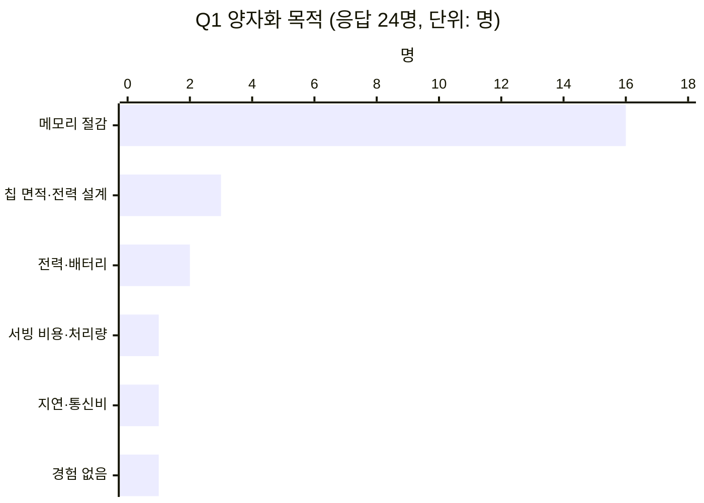

| 목적 | 🟢 긍정 | 🟡 모르겠음 | 🔴 부정 | 합계 |
|---|:-:|:-:|:-:|:-:|
| 메모리 절감 | 8 | 5 | 3 | **16** |
| 칩 면적·전력 설계 검증 | 3 | | | 3 |
| 전력·배터리 | 2 | | | 2 |
| 서빙 비용·처리량 | 1 | | | 1 |
| 지연·통신비 | | 1 | | 1 |
| 경험 없음 | | | 1 | 1 |

**해석** — 목적이 **"칩 설계 검증"인 3명(01·02·07)은 모두 긍정**이었습니다. 이들은 칩이 나오기 *전에* 계산 규칙을 정하는 사람들이라, "칩과 똑같이 계산하는 흉내 장치"가 업무의 중심입니다. 반면 "메모리 절감" 16명은 판정이 갈렸고, 갈린 이유는 목적이 아니라 **역할**(칩 계산을 직접 보는지)이었습니다 → B-6 사분면.

#### Q2 · 무엇이 달랐나요? → 증상은 한 가지로 몰리지 않습니다

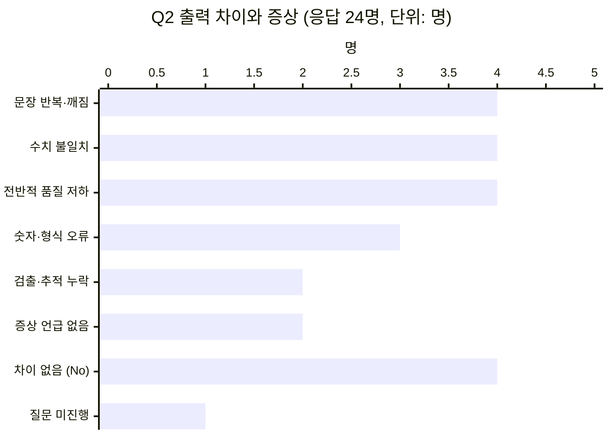

**핵심 발견: 같은 증상, 다른 원인.** 원인까지 찾은 사람들의 증상과 원인을 이어 보면, **같은 "문장 반복"이 03에서는 누산기, 04에서는 반올림** 때문이었습니다. 증상만 보고는 원인을 알 수 없으니, **계산 규칙 하나하나를 바꿔 가며 확인할 수 있어야** 합니다.

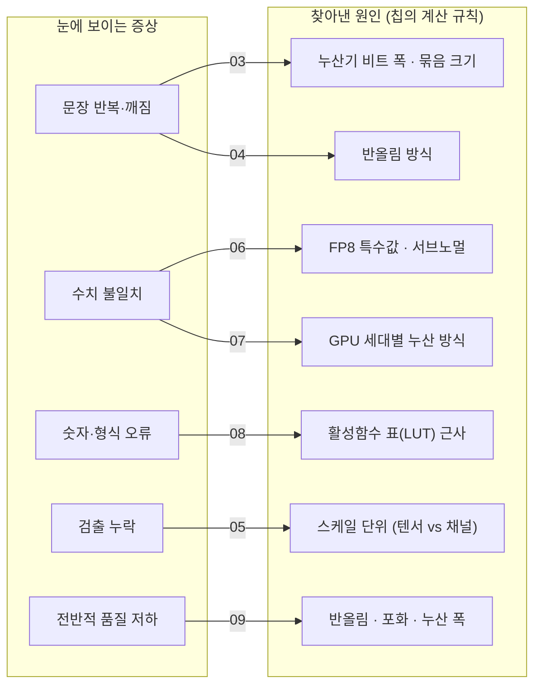

#### Q3 · 어떻게 해결했나요? → 원인을 찾은 9명, 오래 헤맨 5명, 모르는 6명

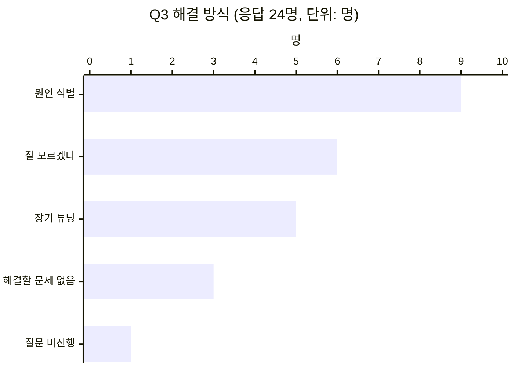

| 원인 유형 (원인 식별 9명 + 관련 언급) | 로그 | 개수 |
|---|---|:-:|
| 누산기 비트 폭 · 묶음 크기 · GPU 세대별 누산 | 01, 02, 03, 07, 09 | 5 |
| 반올림 방식 | 04, 09, 11 | 3 |
| 칩이 계산 규칙을 공개하지 않음 | 09, 14, 16 (+27 거절 사유) | 3 |
| FP8 특수값 · 서브노멀 | 06 | 1 |
| 스케일 단위 (텐서 / 채널) | 05 | 1 |
| 이상치 분리 · 희소 패턴 | 02 | 1 |
| KV 캐시 양자화 | 13 | 1 |
| 활성함수 표(LUT) 근사 | 08 | 1 |

> [!IMPORTANT]
> **가장 많이 나온 원인은 "누산기"(5건)입니다.** 칩은 곱한 값을 좁은 칸에 모아 더하면서 작은 자릿수를 버리는데, PC의 fake-quant는 넉넉한 칸(fp32)에 더해서 이 손실이 보이지 않습니다(03). TriCast 코드가 누산 방식을 가장 세밀하게(알고리즘 5종, 프리셋 8종) 다루는 이유가 여기에 있습니다 → [스펙 §5](../SPEC.md).

### B-5. 비용 분석 — 얼마나 오래 걸렸나요?

기간을 직접 말한 11명의 "원인 규명 · 재튜닝 · 일정 지연" 기간입니다 (달력 기준 일수로 환산: 1주 = 7일, 1개월 = 30일).

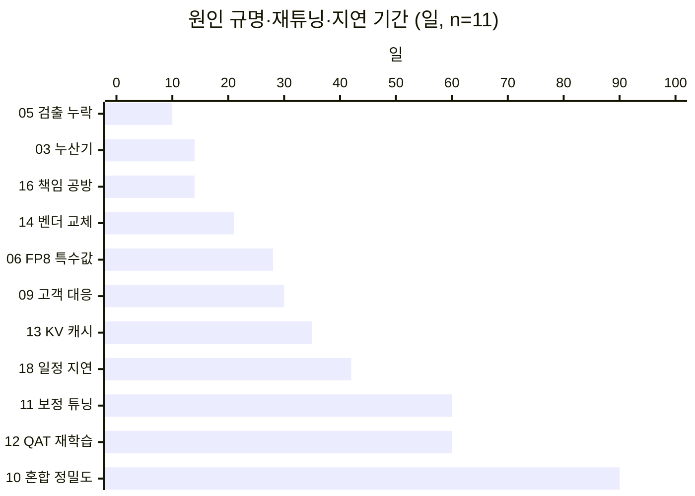

| 통계 | 값 |
|---|---|
| 중앙값 | **30일** |
| 평균 | 36.7일 (긍정 9명만: 38.7일) |
| 범위 | 10일 ~ 90일 |
| 합계 | **404일** — 11명이 같은 종류의 문제에 쓴 달력 시간 |
| 1회 확인에 드는 시간 | 보드 굽기 40분(05) · 칩 탑재·평가 반나절(10) · 긴 문맥 실험 수 시간(13) · 재학습 3일(12) · 커널 수정·재검증 4일(07) · C 모델 문장당 20분(03) |
| 탐색하지 못한 설계 공간 | 07: 원하는 조합 30개 이상 중 **6개만** 실행 (20% 이하) |
| 사람으로 해결한 경우의 비용 | 24: 칩 세대마다 **6명 × 3개월 = 18인월** |

> [!TIP]
> **쉽게 읽기**: 한 번 확인하는 데 수십 분~며칠이 걸리니, 몇 번만 시도해도 몇 주가 지나갑니다. 문제의 크기는 "한 번의 실수"가 아니라 **"느린 확인 × 여러 번 반복"** 에서 나옵니다.

### B-6. 누가 1차 사용자인가 — 사분면 분석

각 응답자를 두 기준으로 점수화해 배치했습니다 (연구자 코딩, 규칙은 아래 표).

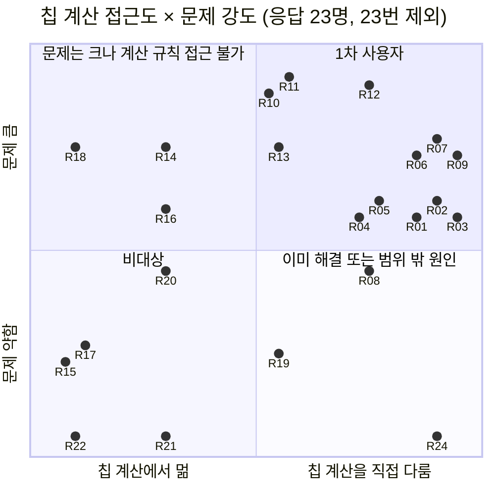

점수 규칙 (펼치기)

| 칩 계산 접근도 (가로) | 점수 | | 문제 강도 (세로) | 점수 |
|---|:-:|---|---|:-:|
| 사용자 · PM · 학생 · GPU 서빙만 | 0.1 | | 문제 없음 · 경험 없음 | 0.05 |
| 포팅 · 벤더 툴 의존 · 계산 규칙 비공개 칩 | 0.3 | | 차이는 봤으나 측정·기간 불명 | 0.25 |
| 모델 최적화 (칩 계산은 간접) | 0.55 | | 영구 우회 (속도·품질 손실 감수) | 0.45 |
| 임베디드 · 온디바이스 직접 변환 | 0.75 | | 1~2주, 또는 구조적 반복 비용 진술 | 0.6 |
| NPU 설계 · 검증 · 컴파일러 · FAE · 연구 | 0.9 | | 3~6주 | 0.75 |
| | | | 2개월 이상 | 0.9 |

같은 점수의 점은 겹치지 않게 ±0.045 이내로 옮겨 표시했습니다. 24는 비용을 전담 인력으로 이미 흡수한 사례라 문제 강도를 0.05(문제 없음)로 코딩했습니다 — 규칙표의 비용 항목(세대마다 6명 × 3개월)만 적용하면 0.6~0.9 이고, 그 경우 ①은 13명 중 12명이 긍정입니다.

| 사분면 | 응답자 | 판정 구성 | 의미 |
|---|---|---|---|
| **① 1차 사용자** (오른쪽 위) | 01 02 03 04 05 06 07 09 10 11 12 13 | **🟢 12 / 12 (100%)** | 칩 계산을 직접 다루고 비용도 크게 치른 사람들 — TriCast의 1차 대상 |
| ② 접근 불가 (왼쪽 위) | 14 16 18 | 🟢 1 · 🟡 2 | 문제는 크지만 칩 계산 규칙을 모름 → 레시피를 쓸 수 없음 (현재 비대상) |
| ③ 비대상 (왼쪽 아래) | 15 17 20 21 22 | 🟡 3 · 🔴 2 | 원인을 파고들 역할이 아니거나 문제가 없음 |
| ④ 해결됨·범위 밖 (오른쪽 아래) | 08 19 24 | 🟢 1 · 🟡 1 · 🔴 1 | 08은 원인(LUT)이 레시피 범위 밖, 24는 전담팀으로 해결, 19는 비교 미실시 |

> [!IMPORTANT]
> **"잘 모르겠음" 6명은 한 명도 ①에 없습니다.** 즉 "모르겠다"는 문제가 없어서가 아니라 **원인을 볼 수 있는 자리에 있지 않아서** 나온 답입니다. 그래서 다음 인터뷰는 섭외 단계에서 "칩 계산 사양을 직접 보는지"를 먼저 확인합니다 (A-2).

### B-7. 도출된 페인 (누적 — 범주와 로그 번호)

| # | 페인 | 범주 | 로그 | 근거 수 |
|:-:|---|:-:|---|:-:|
| P1 | 개발 환경의 양자화 흉내(fake-quant)가 칩의 계산 규칙(누산 폭·반올림·특수값·스케일 단위)을 재현하지 못해, **칩에 올린 뒤에야** 차이를 발견한다 | 문제 | 02, 03, 04, 05, 06, 07, 08, 09, 11 | 9 |
| P2 | 칩·정밀도·GPU 세대가 바뀔 때마다 계산 흉내 코드(CUDA 커널)를 **다시 쓰고 다시 검증**한다 | 문제 | 01, 02, 03, 07, 11, 24 | 6 |
| P3 | 원인을 특정하지 못해 레이어별 혼합 정밀도·보정·재학습을 **전수 탐색**한다 (3주~3개월) | 우회로 | 09, 10, 11, 12, 13, 14 | 6 |
| P4 | 칩 계산을 정확히 따라 하는 참조 모델(C 모델)은 **너무 느려** 모델 전체 평가를 못 하고 레이어 단위로만 본다 | 제약 | 03, 09 | 2 |
| P5 | 칩의 계산 사양이 **문서에 없거나 공개되지 않아** 역추정·반복 문의를 한다 | 제약 | 04, 06, 07, 14 (+27) | 4 |
| P6 | 칩에서만 확인할 수 있어 **한 번 확인에 40분~3일**이 걸린다 | 제약 | 05, 10, 12, 13 | 4 |
| P7 | 누가 맞는지 가릴 **공통 비교 기준이 없어** 책임 공방·일정 지연이 생긴다 | 실패 유형 | 06, 16, 18 | 3 |
| P8 | 증상만 가리는 우회(CPU로 빼기, 재시도, 프롬프트 축소)로 **성능을 잃는다** | 우회로 | 08, 17, 20 | 3 |
| P9 | 비용 때문에 설계 공간의 **일부만** 탐색한다 (30개 이상 중 6개) | 실패 유형 | 07 | 1 |
| P10 | 칩 설계 단계에서 누산기 비트 폭·오차 허용치를 **미리 정해야** 면적·전력을 결정할 수 있다 | 목표 | 01, 02, 07 | 3 |
| P11 | 칩을 바꾸거나 발주하기 **전에** 모델이 그대로 돌지 알고 싶다 | 목표 | 14, 18 | 2 |
| P12 | 평균 점수로는 안 보이는 실패(긴 문맥, 작은 물체)가 있다 | 실패 유형 | 05, 13 | 2 |

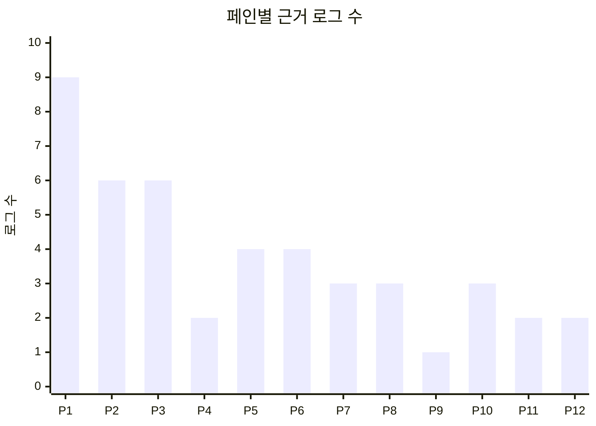

### B-8. 원인 유형 ↔ TriCast 레시피 대조 (코드 기준)

인터뷰에서 나온 원인을 TriCast 코드(`src/tricast/`)가 실제로 표현할 수 있는지 확인했습니다. 상태는 저장소의 `support_matrix.yaml`을 따릅니다.

| 원인 유형 | 로그 | TriCast 레시피 항목 (코드) | 상태 |
|---|---|---|:-:|
| 누산기 비트 폭 · 묶음 크기 · GPU 세대별 누산 | 01 02 03 07 09 | `mma.algorithm` (cofda·gdfs·fp32_fma·fp64·int_exact), `f_bits`, `chunk_size`, `c_mode`, 하드웨어 프리셋 8종 | ✅ 검증 |
| 반올림 방식 | 04 09 11 | `rounding` 6종 (rne·rna·rtz·rup·rdn·sr) | ✅ 검증 |
| 정수 재양자화 (시프트 후 버림) | 04 | `rounding: rtz` 로 일부만 표현 — 재양자화 단계를 따로 두는 레시피 항목은 없음 | 🟠 부분 |
| FP8 특수값 · 서브노멀 | 06 | `Format.special` (ieee·fn·fnuz·none), `:nosub` — e4m3 최대값 448, e4m3fnuz 최대값 240이 코드에서 그대로 계산됨 | ✅ 검증 |
| 스케일 단위 | 05 | `granularity` (tensor·row·group·block) | ✅ 검증 |
| 이상치 분리 · N:M 희소 | 02 | `outliers` (fraction·format), `sparsity` (n:m·unstructured) | ✅ 검증 |
| KV 캐시 양자화 | 13 | `kv` (kivi2·kivi4·kv_fp8, `layers`) | 🟡 구현 (CPU 테스트) |
| 레이어별 혼합 정밀도 | 09 10 13 14 | `overrides` (`match`·`layers`·`modules`·`skip`) | 🟡 구현 |
| 보정 데이터 · 클리핑 기준 | 11 12 | `calibration` (samples·seqlen·seed), `scale.method` (mse·percentile) | 🟡 구현 |
| 활성함수 표(LUT) 근사 | 08 | **레시피 항목 없음** | ⛔ 미지원 |
| 칩 계산 규칙 비공개 | 09 14 16 27 | 대상 아님 — 계산 규칙을 모르면 레시피를 쓸 수 없음 | ⛔ 범위 밖 |

### B-9. v1 프로토콜에서 배운 점 (다음 인터뷰 보완)

1. **"비교해 봤는지"를 먼저 묻기** — 19번은 칩과 비교해 본 적이 없는데 Q2에서 No로 잡혔습니다. → v2 질문 2
2. **섭외 단계에서 역할 거르기** — "잘 모르겠음" 6명은 포팅·PM·주니어·학생처럼 칩 계산에 접근하지 않는 역할이었습니다. → v2 대상 정의
3. **비교 대상 확인하기** — 24번처럼 전담 인력을 둔 조직은 이미 사람으로 풀고 있습니다. 그 비용(세대당 18인월)이 TriCast가 비교될 기준입니다.
4. **의향 발언은 증거에서 빼기** — 14번의 "돈 내고 씁니다", 01·02번 마지막 문장("프레임워크가 있으면 도움이 될 것 같다")은 *앞으로의 바람*이지 *과거 행동*이 아니므로 증거로 쓰지 않았습니다.

---

## C. 워크플로 기록 — 진술 기반 재구성

> [!NOTE]
> 아래는 과정을 가장 자세하게 말해 준 두 응답자(03, 07)의 인터뷰 진술을 단계별로 재구성한 기록입니다. 각 표의 가운데 열은 응답자가 말한 단계·횟수·시간만 적었고, 화면 공유 재현은 C-4 계획으로 이어집니다.

### 재구성 1 — 로그 03의 응답자 · "PPL 12가 칩에서 30을 넘은 2주" (인터뷰 진술)

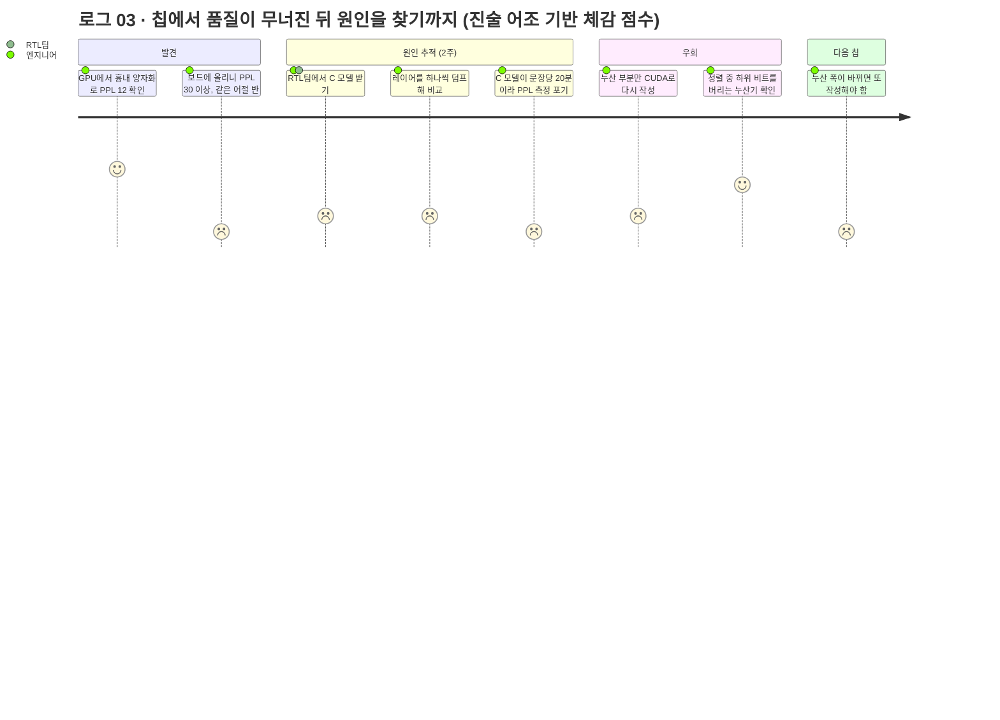

| 관찰 항목 | 진술 내용 (들은 것만 적는다) | 스펙 후보 (무엇으로 바뀌는가) |
|---|---|---|
| 단계와 도구 | ① GPU에서 fake-quant로 PPL 측정 (12대) → ② 보드에 탑재 (30 이상) → ③ RTL 팀에서 C 모델 수령 → ④ 레이어 하나씩 덤프 비교 → ⑤ C 모델로는 PPL 불가 → ⑥ 누산 부분만 CUDA로 재작성 → ⑦ 원인 확정 | 칩 계산 규칙을 **레시피 한 장**으로 쓰고 GPU에서 PPL까지 재는 경로 (`tricast ppl --recipe`) |
| 전환 (Handoff) | 도구가 GPU → 보드 → C 모델(CPU) → 덤프 비교 → 직접 짠 CUDA로 **4번 바뀜**, RTL 팀에 의존 | 한 도구 안에서 "흉내 → 비트 정확 → 모델 평가"가 이어져야 함 |
| 우회로 (Workaround) | 비트 정확 C 모델이 느려서 **평가 단위를 모델 → 문장 → 레이어로 축소** / 누산 부분만 직접 CUDA로 다시 씀 | 비트 정확한데도 빠른 GPU 커널 (`kernels/mma.py`, Triton) |
| 대기 (Waiting) | C 모델 문장 1개 20분 / 원인 확정까지 2주 | 이후 평가 지표 후보: "칩 차이 원인 확정까지 걸린 시간" |
| 반복 | "다음 칩에서 누산 폭이 바뀌면 그걸 또 짜야" | 프리셋·레시피의 숫자 하나(`f_bits`, `chunk_size`)만 바꾸면 되는 구조 |

### 재구성 2 — 로그 07의 응답자 · "30개 중 6개만 돌린 설계 탐색" (인터뷰 진술)

| 관찰 항목 | 진술 내용 | 스펙 후보 |
|---|---|---|
| 단계와 도구 | ① 세대가 다른 GPU 2장에서 같은 FP8 모델 점수가 0.4%p 다름 → ② 자기 코드 버그 의심 → ③ 레이어 출력 비트 덤프 비교 → ④ 행렬곱부터 다름 확인 → ⑤ 랜덤 벡터 수만 개로 누산 정밀도·묶음 크기 **역추정** → ⑥ 칩 후보마다 CUDA 커널 작성 | GPU 세대별 누산 방식을 **출처가 붙은 프리셋**으로 제공 (`nvidia_ada_fp8`, `nvidia_hopper_fp8`, …) |
| 우회로 | 문서가 없어 실험으로 거꾸로 추정 | 프리셋마다 출처·검증 상태 표기 (`provenance`) |
| 반복 비용 | 누산 비트 9 → 13 변경 실험 하나에 **커널 수정 + 재검증 4일** | 비트 수를 축으로 한 스윕 설정 (`configs/sweeps/fp8_cofda_f_sweep.yaml`: F 9개 값 × 결합 방식 2개 = 18점) |
| 포기 | 원하는 조합 **30개 이상 중 6개**만 실행 | 이후 지표 후보: "원하던 조합 중 실제로 평가한 비율" |

### C-3. 진술끼리 비교해 얻은 통찰 — "정확할수록 작게만 볼 수 있다"

03은 "2주 걸렸다"고 말했지만, 그 2주의 실체는 시간보다 **평가 단위가 쪼그라든 것**이었습니다. 칩과 똑같이 계산하는 도구일수록 느려서, 모델 전체 → 문장 → 레이어로 범위를 줄여야 했습니다. 다른 응답자들의 도구도 같은 줄에 놓입니다.

| 지금 쓰는 수단 | 칩과 같은 계산인가 | 얼마나 크게 볼 수 있나 | 조합 바꾸는 비용 | 로그 |
|---|:-:|---|---|---|
| PyTorch fake-quant | ❌ 누산은 fp32, 기본 반올림 | 모델 전체 벤치마크 가능 | 낮음 | 03 09 11 |
| 벤더 SDK 시뮬레이터 | △ LUT 등 일부 미재현, 경고 없는 변환 | 모델 수준 | 낮음 | 05 08 |
| 비트 정확 C 모델 | ✅ | 문장 1개에 수 분~20분 → **레이어 단위만** | 중간 | 03 09 |
| 실제 칩·보드 | ✅ (정의상) | 1회 40분~반나절, 원인은 안 보임 | 높음 (칩 필요) | 05 10 12 |
| 직접 짠 CUDA 커널 | ✅ (직접 검증 필요) | 빠름 | **매우 높음** (조합마다 4일) | 01 02 03 07 |
| 비트 정확 모델 전담팀 | ✅ | 모델 수준 | **세대당 18인월** | 24 |

> [!IMPORTANT]
> **비어 있는 칸**: "칩과 비트 단위로 같고 + 모델 전체를 빠르게 보고 + 조합 변경이 싼" 수단은 24명의 이야기 어디에도 없었습니다. TriCast가 채우려는 칸이 바로 이 자리입니다 (아직 **가설** — D절 Pull 참고).

### C-4. 다음 관찰 계획

| 대상 | 방법 | 볼 것 | 이후 지표로 |
|---|---|---|---|
| 03 또는 07 응답자 | 화면 공유로 "지난 칩 차이 원인 찾기"를 처음부터 재현 (약 30분) | 도구 전환 횟수, 수작업 재입력, 대기 시간, 멈칫한 지점 | 원인 확정까지 걸린 시간, 전환 횟수 |
| 09 응답자 (FAE) | 고객 문의 1건 처리 기록 역추적 | 레이어별 정밀도 조정 반복 횟수 | 고객 문의당 처리 일수 |

---

## D. 핵심 Job Story

> **새 칩(또는 칩 리비전·GPU 세대)에 양자화 모델을 올리거나 칩 연산기의 비트 수를 정해야 할 때,**
> **나는** 그 칩의 수 형식·반올림·누산 방식을 그대로 반영한 결과를 **칩에 넣기 전에** 모델 수준 점수(PPL·벤치마크)로 확인하고 싶다.
> **그래서** 칩에 올린 뒤 원인을 거꾸로 추적하거나 조합마다 커널을 새로 짜지 않고, 설계·배포 결정을 근거와 함께 내릴 수 있도록.
> *(로그 01, 02, 03, 07, 09, 14)*

| 요소 | 내용 | 근거 |
|---|---|---|
| 상황 (트리거) | 칩·리비전·벤더·GPU 세대가 바뀌거나, 아직 없는 칩의 연산기 사양을 정해야 하는 시점 | 로그 03, 04, 07, 14 |
| 기능적 Job | 칩과 같은 계산 규칙으로 모델 품질을 미리 재고, 품질을 떨어뜨리는 규칙(누산·반올림·스케일)을 짚어 내기 | 로그 03, 06, 07, 09 |
| 감정적 Job | "칩에 올렸더니 망가졌다"는 늦은 발견과, 원인을 모른 채 몇 주를 보내는 불안에서 벗어나기 | 로그 10, 11, 18 |
| 사회적 Job | 고객·상사·다른 팀 앞에서 "어느 쪽 문제인지"를 숫자로 보여 주기 | 로그 09, 16, 18 |
| 현재 고용된 대안 | PyTorch fake-quant + 칩에 직접 올려 보기 + 느린 C 모델 + 조합마다 직접 짠 CUDA 커널, 최후에는 레이어별 수동 조정 | 로그 03, 07, 09, 10, 재구성 1·2 |

- 온톨로지로 되쓰기: `Engineer` --targets--> `Chip` (`HardwarePreset` 이 계산 규칙을 담음) → `Engineer` --defines--> `Recipe` (`QuantSpec` · `MMASpec`) --applied_to--> `Model` → `EvalRun` (`env` 와 함께) --reveals--> `Symptom` --caused_by--> `RootCause` --expressed_as--> `Recipe` ([`ontology.yaml`](../ontology.yaml))

### 전환의 네 가지 힘

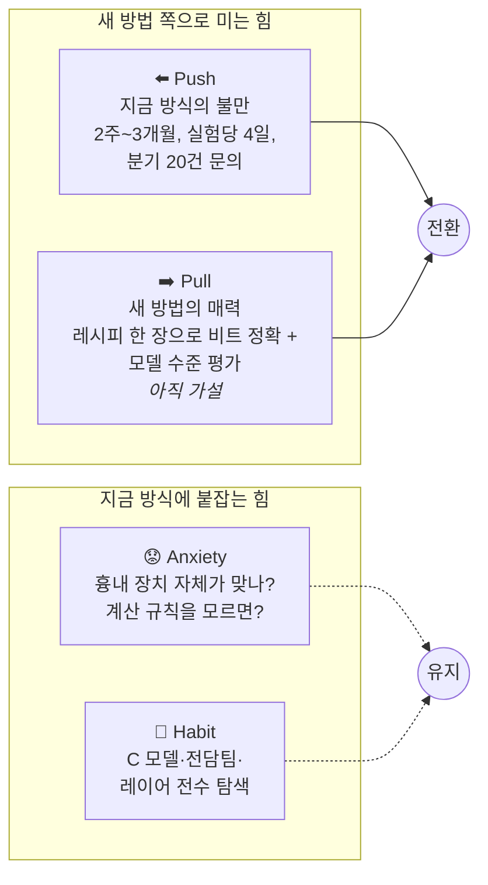

| 힘 | 내용 | 근거 |
|---|---|---|
| **Push** (지금 방식의 불만) | 칩에 올린 뒤에야 차이를 보고, 원인 규명·재튜닝에 중앙값 30일. 조합 하나 바꾸는 데 4일, 원하는 조합의 20% 이하만 탐색 | 로그 03, 07, 09, 10, 12 |
| **Pull** (새 방법의 매력) | 칩 계산 규칙을 레시피로 적으면 GPU에서 비트 단위로 같은 결과를 내고 PPL·벤치마크까지 바로 잼 — **아직 가설, 인터뷰로 검증되지 않음** (01·02·14의 의향 발언은 증거로 쓰지 않음) | (가설) |
| **Anxiety** (새 방법의 불안) | ① 흉내 장치가 정말 칩과 같은지 — 06은 "정답 기준"을 검증하는 데만 1주를 씀 ② 칩 계산 규칙이 공개되지 않으면 레시피를 쓸 수 없음 ③ LUT처럼 레시피에 없는 원인 | 로그 06, 08, 14, 27 |
| **Habit** (관성) | 사내 비트 정확 모델과 전담 인력(24), 느려도 익숙한 C 모델(09), "다 해 봤습니다" 식 레이어 전수 탐색(10), 벤더 툴 기본값이면 충분(21) | 로그 09, 10, 21, 24 |

> [!NOTE]
> **Anxiety에 대한 코드 쪽 대응 (참고)** — TriCast 저장소에는 "흉내 장치가 맞는가"를 따로 검증한 기록이 있습니다: 독립 구현(NADPE)과 비교한 테스트 벡터 **1,716건 모두 비트 일치**, 실제 H200 칩 명령(WGMMA) 비교 **141건 중 140건 일치** (1건은 0 부호·서브노멀 경계에서 차이, `support_matrix.yaml`). 이는 사용자 증거가 아니라 제품 쪽 근거이므로 [스펙](../SPEC.md)에서 다룹니다.

---

## E. 해석 규칙

| 규칙 | 내용 |
|---|---|
| 섭외 경로 | 지인 소개와 멘토를 통해 섭외했다 |
| 무응답 기록 | 회신이 없거나 성사되지 않은 섭외 4건(25~28)도 로그 번호를 매겨 남긴다 |
| 반증 기준 | 문제 실재의 반증 조건(30%)과 그 판정은 [문제 정의서 §4-1](../PROBLEM.md#4-1-문제의-실재-인터뷰-증거로-지금-판정)에 있다 |
| 기간 환산 | 1주 = 7일, 1개월 = 30일 ("두 달 가까이" → 60일). 원문 표현은 로그 표에 함께 남긴다 |
| 사분면 코딩 | 점수 규칙을 B-6에 공개한다. 경계 사례(08·13·19)는 규칙표로 다시 판정할 수 있다 |
| 의향 발언 | "있으면 쓰겠다"류 발언은 증거에서 뺀다 (B-9의 4) |

---

출처: 팀 인터뷰 기록 28건 (「TriCast 인터뷰 사례 모음집」) · TriCast 저장소 코드 (`src/tricast/`, `support_matrix.yaml`, `configs/`).
